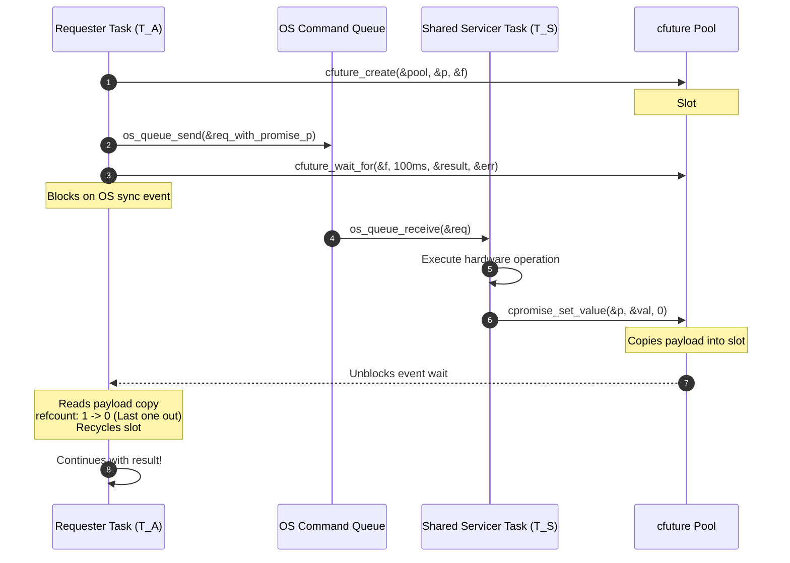
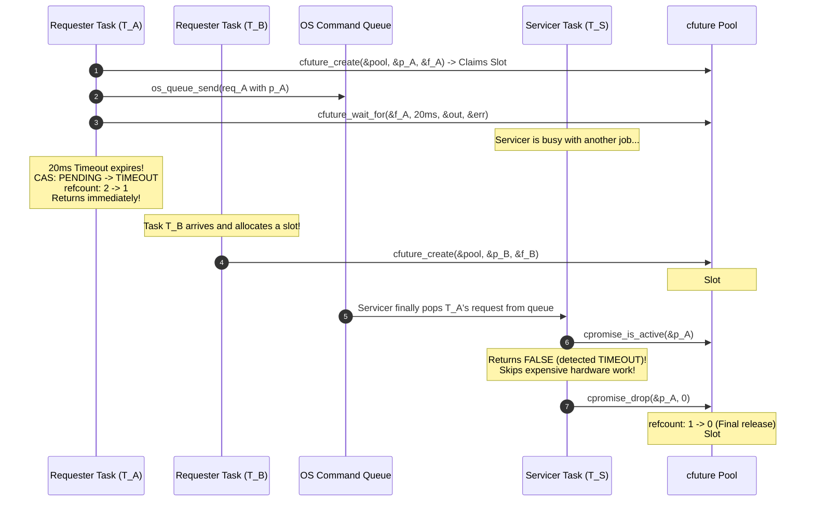

#libcfuture

> **Zero-Heap, Lock-Free Future/Promise Framework for Embedded Systems in C11**

[](LICENSE)
[](https://en.wikipedia.org/wiki/C11_(C_standard_revision))
[]()
[]()
[-success.svg)]()

---

## The Origin Story: Why `libcfuture` Was Created

In professional embedded firmware (FreeRTOS, Zephyr, ThreadX, or bare-metal), subsystems are typically split into a **Shared Servicer Task ($T_S$)** and multiple **Requester Tasks ($T_A, T_B, \dots$)**:
- **$T_S$ (Servicer Task)**: Manages a shared, high-latency resource (e.g., Flash NVM Storage, SPI/I2C Sensor Bus, Cryptographic Engine, or Radio Transceiver). It runs an OS message queue processing incoming commands sequentially.
- **$T_A, T_B$ (Requester Tasks)**: Client subsystems (e.g., Audio recorder, Telemetry streamer, Motor controller) that dispatch asynchronous commands to $T_S$ and block waiting for completion within a deadline (timeout).

### The Three Deadliest Embedded Concurrency Traps

When a requester task ($T_A$) dispatches a job to $T_S$ with a timeout, naive architectures inevitably trigger one of three catastrophic system failures:

#### 1. The Dangling Stack Pointer Horror
If $T_A$ passes a pointer to a stack-allocated response buffer:
```c
void save_telemetry_sample(void)
{
    storage_response_t response; // Stack-allocated!
    storage_request_t req = {.data = sample, .reply_buf = &response};
    os_queue_send(g_storage_queue, &req, 0);

    if (!os_event_wait(g_event, 50)) // 50 ms timeout
    {
        return; // TIMEOUT! Stack frame is unwound and destroyed!
    }
}
```
If $T_S$ takes 70 ms (e.g. delayed by a flash sector erase or high-priority ISR), $T_A$ times out and unwinds its call stack. When $T_S$ finishes at 70 ms and writes the response into `req.reply_buf`, it **silently corrupts the stack of whatever function $T_A$ is now executing**.

#### 2. The Queue ABA Reallocation Hazard (TOCTOU Race)
To prevent dangling pointers, firmware developers often create a pool of static request descriptors. But this introduces a lethal Time-of-Check to Time-of-Use (TOCTOU) race:
1. $T_A$ claims slot #2 from the pool, enqueues request #2 into $T_S$'s command queue, and waits.
2. $T_A$'s timeout expires before $T_S$ can pop request #2 from the queue.
3. If $T_A$ prematurely frees slot #2 back to the pool, a concurrent task **$T_B$ immediately claims slot #2** for a completely different operation and enqueues request #2!
4. $T_S$ now pops $T_A$'s original command from the queue, inspects slot #2, and mistakes it for $T_B$'s request! $T_S$ clobbers $T_B$'s payload with $T_A$'s stale command, causing silent data corruption and erratic firmware behavior.

#### 3. Wasted Peripheral Work & Missing Cancellation
If $T_A$ times out while its request is still sitting in $T_S$'s queue, $T_S$ needs a safe, zero-overhead mechanism to verify:
- **Case 1 (Work not started yet)**: When $T_S$ finally pops the request, can it detect that $T_A$ timed out and skip the expensive hardware operation entirely?
- **Case 2 (Work already started)**: If $T_S$ was already in the middle of writing to the peripheral when $T_A$ timed out, how does $T_S$ safely clean up without writing to a destroyed caller or hanging?

---

### How `libcfuture` Solves This Permanently

`libcfuture` solves all three dilemmas through a **lock-free, zero-heap atomic lifecycle**:

| Challenge | How `libcfuture` Guarantees Safety |
| :--- | :--- |
| **No Dangling Stack Pointers** | Payloads reside in statically allocated pool arenas, completely decoupled from task stacks. |
| **Zero Queue ABA Hazard** | Every slot is guarded by an atomic dual-owner reference count ($2 \to 1 \to 0$). If $T_A$ times out, its refcount drops ($2 \to 1$), but the slot **remains locked and unclaimable by $T_B$** until $T_S$ processes the promise and releases the final reference ($1 \to 0$). Slot reuse collisions are mathematically impossible. |
| **Instant Work Cancellation** | $T_S$ calls `cpromise_is_active(&promise)`. If $T_A$ timed out or abandoned the job, $T_S$ skips the hardware operation immediately. |
| **Safe Late Completion** | If $T_S$ finishes after $T_A$ timed out, `cpromise_set_value()` observes the `TIMEOUT` state, discards the payload copy, drops the final reference ($1 \to 0$), and recycles the slot bit back to the pool cleanly. |

---

## Concurrency Lifecycle Diagrams

### 1. Happy Path: Pipelined Servicer Dispatch



### 2. Timeout, Cancellation & Slot Isolation (Preventing ABA)



---

## 5-Minute Onboarding: Requester & Servicer Pattern

The canonical embedded pattern: a Shared Servicer Task receiving commands over an OS queue from multiple requesters.

```c
#include "adapters/cfuture_posix.h" // or cfuture_freertos.h / cfuture_zephyr.h
#include "cfuture.h"

#include <stdio.h>

#define STORAGE_POOL_SIZE 8U

typedef struct
{
    uint32_t block_address;
    cpromise_t promise;
} storage_cmd_t;

typedef struct
{
    uint32_t bytes_written;
    uint32_t crc32;
} storage_result_t;

CFUTURE_DEFINE_STATIC_BUFFERS(s_nvm, STORAGE_POOL_SIZE, sizeof(storage_result_t));
static cfuture_pool_t s_nvm_pool;

// --- Shared Servicer Task (T_S) ---
void storage_servicer_task(void *queue_handle)
{
    storage_cmd_t cmd;
    while (os_queue_receive(queue_handle, &cmd))
    {
        // 1. Cancellation check: Did the caller already time out while in queue?
        if (!cpromise_is_active(&cmd.promise))
        {
            // Skip expensive flash erase/write completely!
            cpromise_drop(&cmd.promise, 0); // Safely recycles slot
            continue;
        }

        // 2. Perform flash operation...
        storage_result_t res = {.bytes_written = 512, .crc32 = 0xAABBCCDD};

        // 3. Fulfill: If caller timed out while writing, cfuture safely discards res
        cpromise_set_value(&cmd.promise, &res, 0);
    }
}

// --- Requester Task (T_A) ---
bool write_sector_safe(uint32_t block, storage_result_t *out_result)
{
    cpromise_t promise;
    cfuture_t future;

    if (!cfuture_create(&s_nvm_pool, &promise, &future))
    {
        return false; // Pool saturated
    }

    storage_cmd_t cmd = {.block_address = block, .promise = promise};
    os_queue_send(g_storage_queue, &cmd);

    // Wait with 50 ms deadline
    int32_t err = 0;
    if (cfuture_wait_for(&future, 50, out_result, &err))
    {
        return true; // Success: payload received!
    }

    // Timed out or rejected!
    // Caller safely unwinds its stack immediately.
    // Slot remains isolated until T_S pops the promise, preventing ABA collisions!
    return false;
}
```

### 2. Windows (MSVC / Visual Studio / MinGW)

On Windows, use the native Win32 Event adapter (`adapters/cfuture_win32.h`):

```c
#include "cfuture.h"
#include "adapters/cfuture_win32.h"
#include <stdio.h>

#define POOL_CAPACITY 8U

CFUTURE_DEFINE_STATIC_BUFFERS(s_win_slots, POOL_CAPACITY, sizeof(uint32_t));
static cfuture_pool_t s_win_pool;

int main(void)
{
    const cfuture_sync_ops_t *sync_ops = cfuture_win32_sync_ops();
    cfuture_pool_init(&s_win_pool, POOL_CAPACITY, sizeof(uint32_t),
                      s_win_slots_slots, s_win_slots_payload, sync_ops);

    cpromise_t promise;
    cfuture_t future;
    if (cfuture_create(&s_win_pool, &promise, &future))
    {
        uint32_t val = 42;
        cpromise_set_value(&promise, &val, 0);

        uint32_t result = 0;
        if (cfuture_wait_for(&future, 100, &result, NULL))
        {
            printf("Received: %u\n", result);
        }
    }

    cfuture_pool_destroy(&s_win_pool);
    return 0;
}
```

### 3. Type-Safe Macro Interface (No `void *` Casts)

Define subsystem-specific typed wrappers in your headers with a single macro call:

```c
// In telemetry_service.h
typedef struct { float pressure_bar; } pressure_data_t;
CFUTURE_DEFINE_TYPED_POOL(Sensor, pressure_data_t, 8)

// In telemetry_service.c
Sensor_promise_t p;
Sensor_future_t f;
Sensor_create(&pool, &p, &f);

pressure_data_t tx = { .pressure_bar = 1.013f };
Sensor_promise_set(&p, &tx, 0);

pressure_data_t rx;
int32_t err = 0;
Sensor_future_wait(&f, 50, &rx, &err);
```

---

## Microcontroller Porting Notes

### STM32 (Cortex-M3 / M4 / M7 / M33)

- **Cache & Memory Placement**: Place `s_sensor_slots` and `s_sensor_payload` in non-cacheable SRAM or tightly-coupled memory (DTCM) using GCC attributes:
  ```c
  __attribute__((section(".dtcmram"))) static cfuture_slot_t s_slots[8];
  __attribute__((section(".dtcmram"))) static uint8_t s_arena[8 * sizeof(packet_t)];
  ```
- **L1 Cache Maintenance**: If buffers are placed in normal cached AXI SRAM, invalidate the caller's cache line after `cfuture_wait_for()` returns or clean before worker fulfillment:
  ```c
  SCB_InvalidateDCache_by_Addr((uint32_t *)rx_buffer, sizeof(rx_buffer));
  ```
- **Synchronization**: Inject your RTOS event primitives (FreeRTOS EventGroups, Zephyr events, ThreadX flags) via `cfuture_sync_ops_t`.

### ESP32 (Xtensa / RISC-V Dual-Core)

- Compatible across SMP cores via atomic compare-and-swap.
- Inject FreeRTOS EventGroup notifications across cores via `cfuture_sync_ops_t`.

### Raspberry Pi Pico (RP2040 Cortex-M0+)

- Cortex-M0+ lacks native hardware 64-bit atomic instructions. `cfuture.h` uses `uint_fast32_t` (`uint32_t` on 32-bit MCUs), which maps directly to native 32-bit atomic load/store/LDREX/STREX instructions.
- Polling adapter (`adapters/cfuture_polling.h`) provides zero-dependency synchronization for bare-metal multi-core systems via hardware spinlocks.

---

## Automation Script (`build.py`)

A cross-platform Python CLI (`build.py`) is provided for Linux, macOS, and Windows:

```bash
#Run full quality pipeline(clean, build, tests, tsan, asan, stats, lint, bench)
python3 build.py --all

#Individual subcommands:
python3 build.py --build       # Configure & build release library
python3 build.py --test        # Run complete 7-suite unit test suite
python3 build.py --tsan        # Run 100k cycle ThreadSanitizer suite
python3 build.py --asan        # Run AddressSanitizer & UBSan suite
python3 build.py --stats       # Check .text/.data/.bss size & verify 0 dynamic allocations
python3 build.py --lint        # Run cppcheck and clang-format checks
python3 build.py --bench       # Run throughput and latency benchmarks
python3 build.py --clean       # Remove all build directories
```

---

## Building with CMake & Nix

### Using Nix

```bash
#Enter isolated hermetic development shell
nix develop

#Run full automated verification
./build.py --all
```

---

## License

This project is licensed under the terms of the [MIT License](LICENSE).
