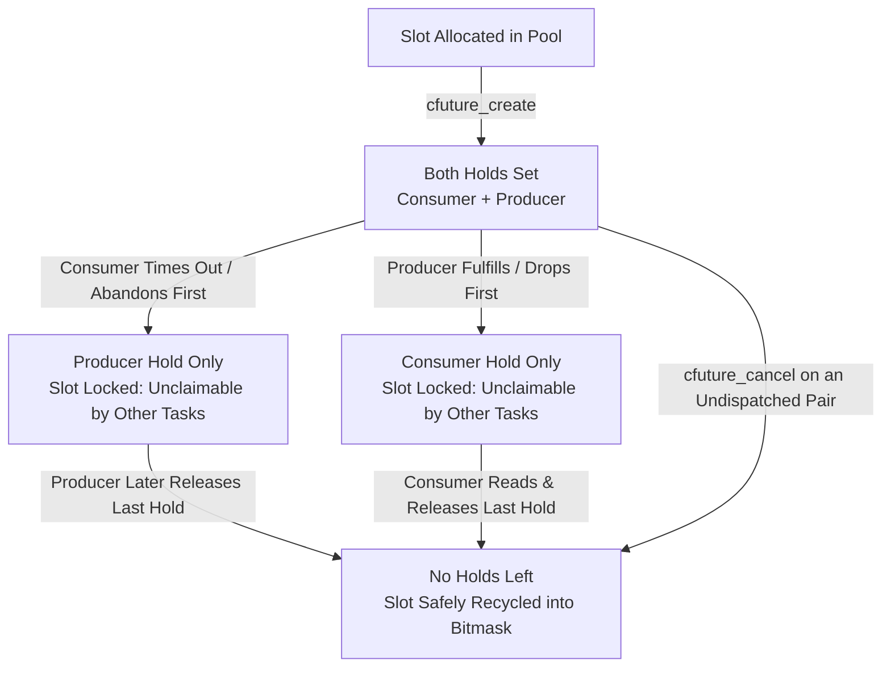
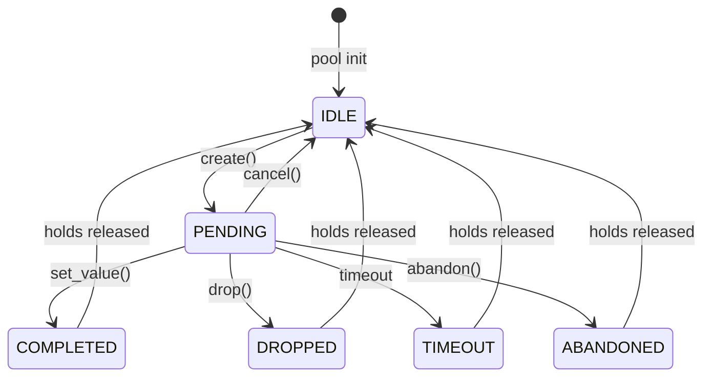
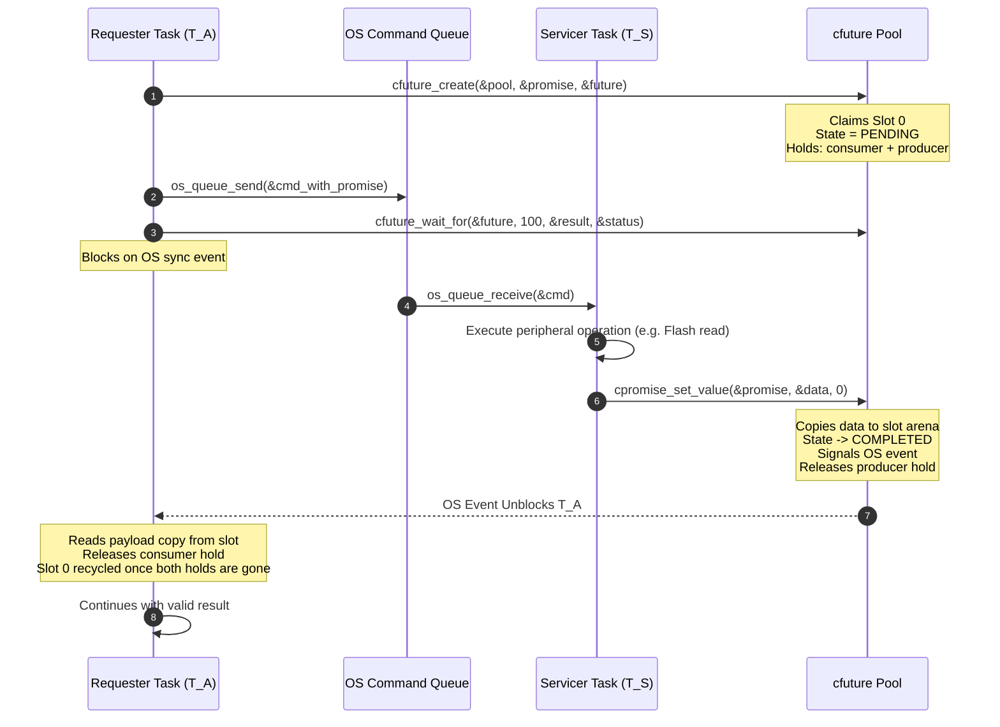
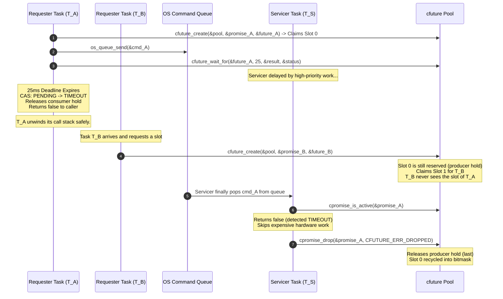
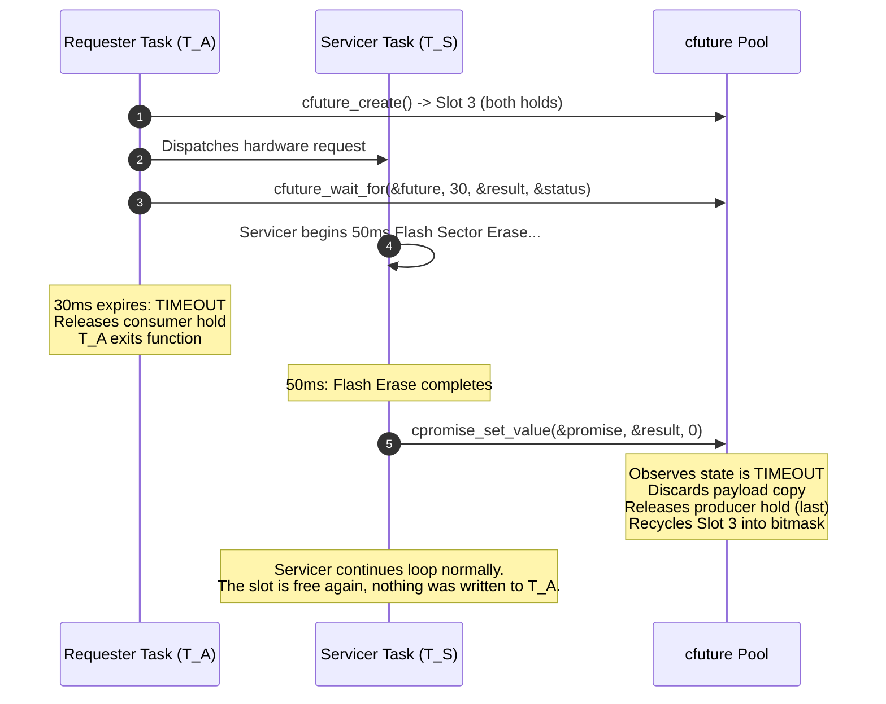
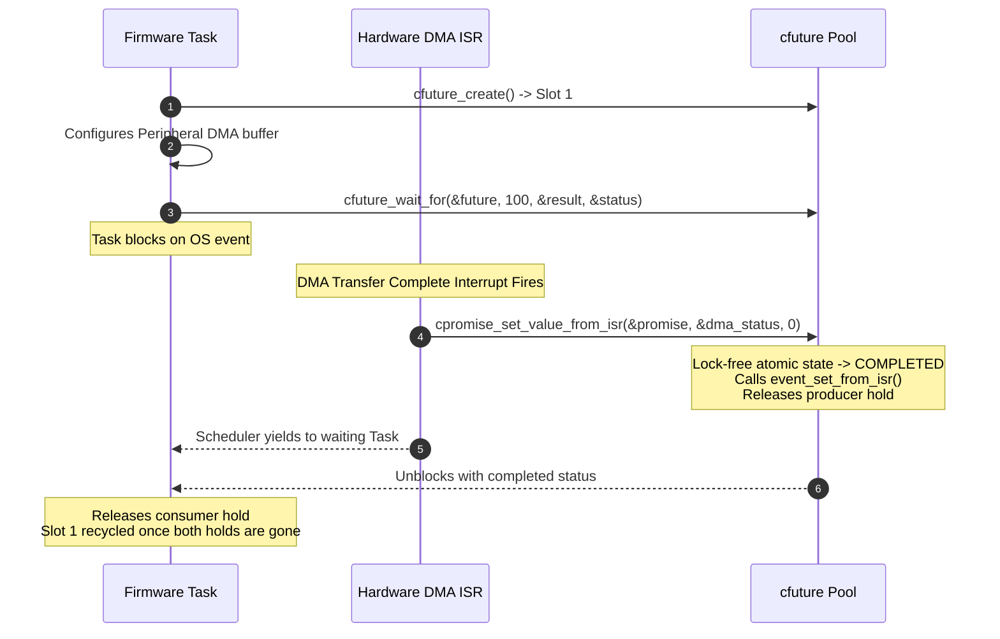

# Janus (`libcfuture`)

A small future/promise utility for C firmware that does not use a heap.

[](https://en.wikipedia.org/wiki/C11_(C_standard_revision))
[](LICENSE)

---

## Table of Contents

- [1. Who was Janus?](#1-who-was-janus)
- [2. The same two faces in software](#2-the-same-two-faces-in-software)
- [3. Why not just use that in firmware?](#3-why-not-just-use-that-in-firmware)
- [4. How it works, in plain terms](#4-how-it-works-in-plain-terms)
- [5. The problems it addresses](#5-the-problems-it-addresses)
  - [Problem 1: the reply pointer outlives the caller](#problem-1-the-reply-pointer-outlives-the-caller)
  - [Problem 2: a slot is reused while its request is still queued](#problem-2-a-slot-is-reused-while-its-request-is-still-queued)
  - [Problem 3: work that nobody is waiting for](#problem-3-work-that-nobody-is-waiting-for)
- [6. How it is built](#6-how-it-is-built)
  - [Layers](#layers)
  - [Two holds per slot](#two-holds-per-slot)
  - [Claiming a slot](#claiming-a-slot)
  - [Platform Abstraction Layer (PAL - `cfuture_pal.h`)](#platform-abstraction-layer-pal---cfuture_palh)
  - [Plugging in your RTOS (`cfuture_sync_ops_t`)](#plugging-in-your-rtos-cfuture_sync_ops_t)
  - [Fulfilment from Interrupt Context](#fulfilment-from-interrupt-context)
  - [Typed wrappers](#typed-wrappers)
- [7. States and transitions](#7-states-and-transitions)
  - [State diagram](#state-diagram)
  - [Transition table](#transition-table)
- [8. Workflows](#8-workflows)
  - [Workflow 1: Pipelined Servicer Dispatch (Happy Path)](#workflow-1-pipelined-servicer-dispatch-happy-path)
  - [Workflow 2: Timeout, Cancellation & Slot Isolation](#workflow-2-timeout-cancellation--slot-isolation)
  - [Workflow 3: Late Completion Discard (Worker Completes After Timeout)](#workflow-3-late-completion-discard-worker-completes-after-timeout)
  - [Workflow 4: Hardware Interrupt (ISR) Promise Fulfillment](#workflow-4-hardware-interrupt-isr-promise-fulfillment)
- [9. API reference](#9-api-reference)
  - [Status and Error Codes](#status-and-error-codes)
  - [Pool Management](#pool-management)
  - [Future & Promise Creation](#future--promise-creation)
  - [Consumer (Future) Operations](#consumer-future-operations)
  - [Producer (Promise) Operations](#producer-promise-operations)
  - [Platform Abstraction Layer (PAL) Primitives](#platform-abstraction-layer-pal-primitives)
  - [Synchronization Provider Contract (OSAL)](#synchronization-provider-contract-osal)
  - [Typed Pool Static Generators](#typed-pool-static-generators)
- [10. Platforms and adapters](#10-platforms-and-adapters)
  - [Adapters at a glance](#adapters-at-a-glance)
  - [Native POSIX Adapter (Linux / macOS)](#native-posix-adapter-linux--macos)
  - [Native Win32 Adapter (Windows)](#native-win32-adapter-windows)
  - [Atomic Polling Adapter (Bare-Metal / No-OS)](#atomic-polling-adapter-bare-metal--no-os)
  - [RTOS Targets (FreeRTOS, ThreadX, Zephyr)](#rtos-targets-freertos-threadx-zephyr)
- [11. Porting notes](#11-porting-notes)
  - [Data Cache and DMA (Cortex-M7 / M55 / M85)](#data-cache-and-dma-cortex-m7--m55--m85)
  - [Cortex-M0/M0+ Atomics](#cortex-m0m0-atomics)
  - [Multi-Core Payload Publication](#multi-core-payload-publication)
- [12. Repository layout](#12-repository-layout)
- [13. Getting started](#13-getting-started)
  - [Get the code](#get-the-code)
  - [Dependencies](#dependencies)
  - [Build and run the tests](#build-and-run-the-tests)
  - [Using it in your own project](#using-it-in-your-own-project)
- [14. Usage examples](#14-usage-examples)
  - [The smallest useful example](#the-smallest-useful-example)
  - [A servicer task and a requester with a deadline](#a-servicer-task-and-a-requester-with-a-deadline)
  - [Fulfilling a promise from an interrupt handler](#fulfilling-a-promise-from-an-interrupt-handler)
- [15. Building and testing](#15-building-and-testing)
  - [CLI Reference](#cli-reference)
  - [Nix development shell](#nix-development-shell)
- [16. How it is tested](#16-how-it-is-tested)
  - [Test suites](#test-suites)
  - [Sanitizer runs](#sanitizer-runs)
  - [Static Analysis & Code Style](#static-analysis--code-style)
- [17. Performance](#17-performance)
  - [Code and data size](#code-and-data-size)
  - [Call overhead](#call-overhead)
- [18. License](#18-license)

---

## 1. Who was Janus?

In Roman religion, [Janus](https://en.wikipedia.org/wiki/Janus) is the god of beginnings, gates, transitions, doorways, passages and endings. He is usually shown with a double-sided head: one face turned toward what has already happened, the other toward what is still to come. The month of January is named for him, and the gates of his temple in Rome stood open in time of war and were closed to mark the arrival of peace.

He is a fitting patron for a doorway, because a doorway is one thing seen from two sides.

---

## 2. The same two faces in software

Programs have doorways like that too. One task asks another to do something slow: write a flash sector, read a sensor, talk to a radio. From that moment there are two views of the same piece of work:

- The task that asked is looking **forward**. It is waiting for a result that does not exist yet.
- The task that does the work is looking **back**. It holds a request that was made earlier, and it owes somebody an answer.

C++ gives these two views names. `std::promise` is the side that owes the answer, `std::future` is the side that waits for it, and the two are joined by a small piece of shared state that outlives whichever side finishes first. The caller can wait with a time limit, give up, and walk away; the worker can still deliver into the shared state later without hurting anyone.

---

## 3. Why not just use that in firmware?

That shared state lives on the heap, and the C++ library machinery around it expects exceptions and a runtime. A lot of embedded code is plain C, and much of it avoids dynamic allocation on purpose: a heap can fragment, an allocation can fail at an awkward moment, and the time it takes is hard to bound.

So firmware usually builds the arrangement by hand. The asking task puts a request on an RTOS queue, includes a pointer to a result variable on its own stack, and blocks on an event with a timeout. That works until the day the timeout fires first. The asking task returns, its stack frame is reused by something else, and a little later the worker writes its answer through a pointer that now points into the middle of someone else's variables.

The obvious repair is a static pool of result slots instead of stack variables. That brings its own trap: if the asking task hands its slot back when it times out, the next task can be given the same slot while the first request is still sitting in the queue.

Janus is an attempt at the smallest utility that gives C firmware the two-faced arrangement without a heap and without those two traps.

---

## 4. How it works, in plain terms

Picture a short row of numbered pigeonholes on the wall, the kind a hotel keeps behind the front desk. The row is ordinary static memory that you declare yourself; its length is fixed when you build.

1. **Asking for a pair.** `cfuture_create()` picks a free pigeonhole and gives you two tickets for it. One ticket is the *future*: you keep it. The other is the *promise*: it travels with your request to whoever will do the work, as a plain value inside your queue message.
2. **Answering.** When the work is done, the worker hands in its promise ticket together with the answer (`cpromise_set_value()`). The answer is copied into the pigeonhole, never to an address on your stack, and a bell is rung. If the work cannot be done, the worker hands the ticket in without an answer (`cpromise_drop()`).
3. **Waiting.** `cfuture_wait_for()` stands at the bell with a time limit. If the answer arrives, it is copied out to you. If the time runs out, you simply leave. Nothing of yours is referenced by the worker, so nothing of yours can be overwritten later.
4. **Giving the pigeonhole back.** A pigeonhole goes back on the free list only when *both* tickets have been handed in. If you left early, it stays reserved until the worker turns up with the promise, finds that nobody is waiting, discards its answer and hands the ticket in. That is what stops the next task from being given a pigeonhole that an old request still points to.
5. **Old tickets are refused.** Each ticket carries a serial number that changes every time a pigeonhole is reused. A ticket that was copied, used twice, or kept from an earlier round does not open the pigeonhole for its next occupant; the call just does nothing.
6. **Changing your mind.** If the request never left your hands, for example because the queue was full, `cfuture_cancel()` takes both tickets back in one step.

The worker can ask `cpromise_is_active()` before starting expensive work, and skip it if the asking side has already gone. The answering side can also be an interrupt handler, using the `_from_isr` variants.

The "bell" is whatever your system offers: an RTOS event or semaphore that you plug in through a small table of function pointers, or nothing at all, in which case the waiting side polls. That is the whole idea. The rest of this document fills in the details.

---

## 5. The problems it addresses

This section looks more closely at the situations sketched above. Throughout, $T_S$ is a *servicer* task that owns a slow shared resource (flash, an SD card, a sensor bus, a radio) and takes commands from an RTOS queue, and $T_A$, $T_B$ are *requester* tasks that send it work and wait for the result with a deadline.

### Problem 1: the reply pointer outlives the caller

To avoid dynamic memory allocation, a requester task $T_A$ often allocates its response structure on its local call stack and passes a pointer across the queue:

```c
// BROKEN PATTERN: Stack-allocated response pointer
void record_audio_block(const uint8_t *pcm_data)
{
    storage_response_t response; // Allocated on T_A's stack frame
    storage_request_t req = {
        .payload = pcm_data,
        .reply_ptr = &response   // Dangerous pointer passed to T_S
    };

    os_queue_send(g_storage_queue, &req, 0);

    // Block with 50 ms timeout
    if (!os_event_wait(g_event_handle, 50))
    {
        // TIMEOUT! Function returns immediately.
        // T_A's stack frame is unwound and reclaimed by the CPU.
        return;
    }
    process_response(&response);
}
```

**What goes wrong**: If $T_S$ takes 65 ms (due to a high-priority interrupt storm, flash sector erase, or bus contention), $T_A$ times out and returns. Its stack frame is reused by subsequent function calls. When $T_S$ finishes at 65 ms and executes `*req.reply_ptr = result;`, it **silently writes into the middle of $T_A$'s current, active stack**, corrupting return addresses, saved registers, and local variables. This manifests as random, non-reproducible `HardFault` crashes hours or days later.

---

### Problem 2: a slot is reused while its request is still queued

To eliminate stack pointers, developers introduce a static pool of pre-allocated request slots. However, handing the slot back too early creates a time-of-check to time-of-use race:

```text
Time   Task T_A (Audio)             OS Storage Queue           Task T_B (Telemetry)        Task T_S (Storage Servicer)
 │
 ├───> Claims Slot #2 from pool
 ├───> Posts Slot #2 pointer ─────> [ Slot #2 ]
 ├───> Waits with 20ms timeout
 │                                                                                        Busy erasing flash block...
 ├───> 20ms Timeout Expires
 ├───> T_A frees Slot #2 to pool
 │                                                                                        Still busy...
 ├───>                              [ Slot #2 ]                Claims Slot #2 from pool
 │                                                             Writes Telemetry Payload
 ├───>                              [ Slot #2 ] ─────────────> Posts Slot #2 pointer
 │                                                             [ Slot #2 (T_A), Slot #2 (T_B) ]
 │                                                                                        Pops first item: Slot #2
 │                                                                                        Executes T_A's stale command
 │                                                                                        CLOBBERS T_B's payload
```

**What goes wrong**: Because $T_A$ freed the slot while its request was still queued in the OS message queue, $T_B$ was granted the exact same slot. When $T_S$ eventually services the first queue entry, it operates on $T_B$'s memory under the assumption that it is executing $T_A$'s job. Data from one subsystem overwrites data from an unrelated subsystem with zero compiler or OS warnings.

---

### Problem 3: work that nobody is waiting for

When an operation takes longer than the caller can tolerate, the servicer requires a race-free mechanism to query request validity:
- **Pre-Execution Cancellation**: When $T_S$ dequeues a request that sat in the queue for too long, it should check whether the caller has already abandoned it. If abandoned, $T_S$ must skip the peripheral transaction (e.g., avoid an unnecessary 100 ms Flash erase or 50 ms SD card sector write).
- **In-Flight Cancellation Recovery**: If $T_A$ times out while $T_S$ is actively writing to hardware, $T_S$ must complete its hardware transaction cleanly and discard the result safely without writing to destroyed memory or hanging on unserviced synchronization events.

---

## 6. How it is built

The pigeonholes, tickets and bell from section 4, now with their real names. A pigeonhole is a *slot*, a ticket is a *handle*, handing a ticket in is *releasing a hold*, and the serial number is the *generation*.

### Layers

Dependencies point one way only. The core library depends on no operating system and no heap; from the toolchain it needs `<stdatomic.h>`, `memcpy`/`memset` and a count-trailing-zeros builtin:

```text
┌─────────────────────────────────────────────────────────────────────────────┐
│ LAYER 1: CLIENT APPLICATION & SERVICER THREADS                              │
│ Audio Streamer Task (T_A) │ Telemetry Task (T_B) │ Storage Task (T_S)       │
├─────────────────────────────────────────────────────────────────────────────┤
│ LAYER 2: TYPE-SAFE SUBSYSTEM WRAPPERS                                       │
│ CFUTURE_DEFINE_STATIC_BUFFERS() │ CFUTURE_DEFINE_TYPED_POOL() Macros        │
├─────────────────────────────────────────────────────────────────────────────┤
│ LAYER 3: CORE LOCK-FREE FUTURE / PROMISE ENGINE                             │
│ cfuture.h / cfuture.c (Zero-Heap, Dual-Owner Hold-Bit + Generation Engine)  │
│ Bitmask CAS Allocation (atomic_uint_fast32_t) │ Bounded Retry Real-Time Loop│
├─────────────────────────────────────────────────────────────────────────────┤
│ LAYER 4: DEPENDENCY-INJECTED SYNCHRONIZATION OSAL                           │
│ cfuture_osal.h: const cfuture_sync_ops_t *sync_ops (Function Pointer Table) │
├─────────────────────────────────────────────────────────────────────────────┤
│ LAYER 5: PLATFORM ABSTRACTION LAYER (PAL)                                   │
│ cfuture_pal.h / cfuture_pal.c: cfuture_pal_time_ms() │ cfuture_pal_cpu_relax│
├─────────────────────────────────────────────────────────────────────────────┤
│ LAYER 6: TARGET PLATFORMS & ADAPTER IMPLEMENTATIONS                         │
│ cfuture_posix (Pthreads) │ cfuture_win32 (Events) │ cfuture_polling (Atomic)│
│ FreeRTOS EventGroups     │ Azure ThreadX Flags    │ Zephyr Kernel Events    │
└─────────────────────────────────────────────────────────────────────────────┘
```

---

### Two holds per slot

Every slot in a `cfuture_pool_t` starts with **2** holders, tracked as one hold bit per side in the slot's atomic `owner` word:
- **Owner 1** (`CFUTURE_HOLD_CONSUMER`): The Consumer handle (`cfuture_t`), held by the requester task.
- **Owner 2** (`CFUTURE_HOLD_PRODUCER`): The Producer handle (`cpromise_t`), held by the servicer task or ISR.

There is no counter: a slot is owned while either bit is set, and whichever side clears the last bit recycles it. Because each side can only ever clear *its own* bit, a duplicated or replayed handle can never release the other side's hold (a shared counter could not tell whose decrement it was receiving).



#### Why a timed-out slot is not handed to someone else
When task $T_A$ times out, it clears only its own consumer hold; the producer hold is still set. The slot is not recycled back to the pool. Because its bit remains set in `allocated_mask`, concurrent task $T_B$ **cannot claim this slot**. 

Only when servicer task $T_S$ pops $T_A$'s request from the queue and releases the producer hold is the last hold gone. The final owner performs the slot recycling, so a slot cannot be reused while its producer hold is set. The one exception is a successful `cfuture_cancel()`, which recycles the slot at once; a promise copy still sitting in a queue is then rejected by its generation tag instead.

#### Serial numbers on the tickets: generations and claims
Handles are plain structs and get copied (into queue messages, retry paths, ISR contexts), so the library also defends against a handle that is used twice or outlives its slot:

- **Generation tag**: the `owner` word is `(generation << CFUTURE_GEN_SHIFT) | hold bits`. Every recycle bumps the generation (wrapping at `CFUTURE_GEN_MASK` and skipping 0, which is never valid). `cfuture_t` / `cpromise_t` carry the generation they were created with.
- **Exclusive claim**: before touching a slot, `cpromise_set_value()` / `cpromise_drop()` claim the producer side and `cfuture_wait_for()` / `cfuture_abandon()` claim the consumer side with a single bounded CAS on `owner`. That one CAS verifies the generation, verifies the side's hold bit is still present, and sets the side's claim bit.
- **Restart spacing**: every `cfuture_pool_init()` (counted by one process-wide epoch) starts its slots from a different point of the 28-bit generation space, so a handle that survived a destroy + re-init of the same buffers does not match the pool's new life until that slot has been recycled enough times to reach the old generation (tens of millions of recycles with the current spacing). This is spacing, not a guarantee.
- **Limit**: the tag is 28 bits and skips 0, so generations repeat every $2^{28}-1$ recycles of a slot. A handle kept that long would match again; discard handles once they are spent instead of storing them.
- **Effect**: a stale handle (slot already recycled, possibly reallocated), a forged handle to an unallocated slot, or the second of two concurrent calls on copies of the same handle all fail the claim and become no-ops (`cfuture_wait_for()` reports `CFUTURE_ERR_INVALID`). They cannot write the payload arena, signal the event, complete the slot's next occupant, or double-release a hold.

---

### Claiming a slot

Slot allocation is lock-free and operates on a single `atomic_uint_fast32_t allocated_mask` representing up to 32 concurrent slots (`CFUTURE_MAX_CAPACITY`). Simplified from `cfuture_pool_claim_slot()` in `src/cfuture.c` (the real function uses `uint_fast32_t` locals and returns the slot index):

```c
// Lock-free atomic bitmask allocation loop (simplified)
uint32_t current_mask = atomic_load_explicit(&pool->allocated_mask, memory_order_relaxed);
uint32_t retries = 0;

while (retries < CFUTURE_CAS_MAX_RETRIES)
{
    uint32_t free_bits = (~current_mask) & valid_capacity_mask;
    if (free_bits == 0U)
    {
        return false; // Pool saturated: deterministic rejection
    }

    uint32_t slot_id = (uint32_t)__builtin_ctz(free_bits);
    uint32_t new_mask = current_mask | (1U << slot_id);

    if (atomic_compare_exchange_weak_explicit(&pool->allocated_mask, &current_mask, new_mask,
                                              memory_order_acq_rel, memory_order_relaxed))
    {
        *out_slot = slot_id;
        return true; // Successfully claimed in bounded time
    }
    retries++;
}
return false; // Contention budget exceeded
```

- **Bounded Execution**: at most `CFUTURE_CAS_MAX_RETRIES` (1000 attempts) weak-CAS attempts; the constant is private to `cfuture.c`. The loop is bounded, not constant-time, and under heavy contention `cfuture_create()` can return `false` even though a slot is free.
- **Bit Scan**: `__builtin_ctz` / `_BitScanForward`, a hardware bit-scan where the core has one (RBIT+CLZ on Cortex-M3/M4; a libgcc call on Cortex-M0).

---

### Platform Abstraction Layer (PAL - `cfuture_pal.h`)

For hardware-level clock timing and instruction pipeline relaxation, `libcfuture` introduces an unopinionated Platform Abstraction Layer (`cfuture_pal.h` / `src/cfuture_pal.c`):

- **Monotonic Hardware Clock (`cfuture_pal_time_ms`)**: Returns the platform's monotonic hardware time in milliseconds without requiring an RTOS timer service. It times `cfuture_wait_for()` deadlines in polling mode only; with an OSAL event backend the backend's own timeout is the time base and this clock is not consulted.
  - On **ARM Cortex-M**, it weakly hooks `HAL_GetTick()` if linked into the binary. If no board HAL or hardware timer is linked (e.g. during isolated unit testing or before clock init), it increments an internal fallback counter upon each query to guarantee that wait loops deterministically terminate rather than hanging in an infinite loop. **Note**: Because the unlinked fallback counter increments per query rather than in physical real time, real-time millisecond deadline accuracy requires providing a hardware timer or implementing `HAL_GetTick()`.
  - On host systems, it maps directly to `clock_gettime(CLOCK_MONOTONIC)` (POSIX) or `GetTickCount64()` (Win32).
  - Target firmware can override the weak `cfuture_pal_time_ms()` with its own hardware timer.
- **Why event mode ignores this clock**: a port's tick can be absent, call-counting, or mis-scaled while looking healthy. On-target testing of an earlier revision that timed event waits with this clock showed a 1,000 ms timeout taking 25 s on a ThreadX build whose `HAL_GetTick()` ran about 25x slow. The RTOS's own timed wait is the more trustworthy time base, so event mode uses it exclusively.
- **CPU Relax / Pipeline Yield (`cfuture_pal_cpu_relax`)**:
  - On **ARM Cortex-M**, it issues the Thumb-2 `yield` hint instruction, which executes as a NOP: it saves no power and does not invoke an RTOS scheduler (it was chosen over `WFI` to avoid that instruction's check-then-sleep race).
  - On POSIX it calls `sched_yield()`. On Win32 it calls `YieldProcessor()`, a spin-wait `pause` hint that does not give up the timeslice.

---

### Plugging in your RTOS (`cfuture_sync_ops_t`)

The core (`cfuture.c`) contains zero OS `#ifdef` preprocessor directives; OS differences live only in the PAL and the adapters. Platform synchronization primitives are injected dynamically through a function pointer structure:

```c
typedef struct
{
    /** Allocates/initializes one event per slot. */
    void *(*event_create)(void);
    /** Destroys/releases an event (optional). */
    void (*event_destroy)(void *event_handle);
    /** Signals the event (task context; interrupt context too if event_set_from_isr is NULL). */
    void (*event_set)(void *event_handle);
    /** Waits for the event to be signaled, with timeout in ms (UINT32_MAX = forever).
     *  Returns true if signaled; false from a finite wait means the timeout elapsed. */
    bool (*event_wait)(void *event_handle, uint32_t timeout_ms);
    /** Resets the event: before slot reuse, and when a wait reports a signal although nothing
     *  resolved (optional, can be NULL; provide it for manual-reset events). */
    void (*event_reset)(void *event_handle);
    /** Signals the event from ISR context (optional; falls back to event_set if NULL). */
    void (*event_set_from_isr)(void *event_handle);
} cfuture_sync_ops_t;
```

This permits testing identical embedded business logic on host developer workstations (via POSIX pthreads or native Windows Events) before compiling for physical Cortex-M silicon.

---

### Fulfilment from Interrupt Context

Fulfilling a promise directly from a hardware interrupt service routine (e.g., DMA transfer complete, Timer capture, UART RX idle line) is supported via `cpromise_set_value_from_isr()`:
- The core path is a bounded CAS, a bounded `memcpy` and no blocking call; whether the signal itself is ISR-safe is the adapter's responsibility.
- Dispatches through `sync_ops->event_set_from_isr()` when provided (e.g., `xEventGroupSetBitsFromISR` on FreeRTOS or `tx_event_flags_set` on ThreadX), otherwise through `event_set`.
- Ensures lock-free atomic release of the producer hold.

---

### Typed wrappers

The library provides macro-generated type-safe pools via `CFUTURE_DEFINE_TYPED_POOL(Prefix, Type, Capacity)`. This generates inline wrapper functions whose payload pointers are typed, so passing the wrong payload type is a compile error; the pool's payload size is checked against `sizeof(Type)` at run time.

---

## 7. States and transitions

Each slot also records how its request ended, so the waiting side can tell a result from a refusal from its own timeout.

### State diagram

Every slot transitions deterministically across six discrete states (`IDLE`, `PENDING`, `COMPLETED`, `DROPPED`, `TIMEOUT`, `ABANDONED`). Labels are the API calls without their `cfuture_` / `cpromise_` prefix (`timeout` is `cfuture_wait_for()` reaching its deadline); `create()` sets both holds, `cancel()` applies only to an undispatched pair, and a resolved slot returns to `IDLE` once both holds are released:



---

### Transition table

Every transition out of `PENDING` is a single atomic Compare-And-Swap (CAS); if two threads race, exactly one succeeds and the loser acts on the winning state. `IDLE -> PENDING` and the return to `IDLE` are plain atomic stores, made safe by the allocation bitmask and the holds rather than by a CAS:

| Current State | Target State | Initiating Actor | API Invocation | Hold Effect | Payload Copied? | Event Signaled? |
| :--- | :--- | :--- | :--- | :--- | :--- | :--- |
| `IDLE` | `PENDING` | Pool Allocator | `cfuture_create()` | Sets both holds | No | Reset to clear |
| `PENDING` | `COMPLETED` | Producer / Worker | `cpromise_set_value()` | Clears producer hold | **Yes** (to slot arena) | **Yes** (`event_set`) |
| `PENDING` | `DROPPED` | Producer / Worker | `cpromise_drop()` | Clears producer hold | No | **Yes** (`event_set`) |
| `PENDING` | `TIMEOUT` | Consumer / Caller | `cfuture_wait_for()` | Clears consumer hold | No | No |
| `PENDING` | `ABANDONED` | Consumer / Caller | `cfuture_abandon()` | Clears consumer hold | No | No |
| `COMPLETED` / `DROPPED` | unchanged | Consumer / Caller | `cfuture_wait_for()` | Clears consumer hold | Copied **out** to caller on `COMPLETED` only | No |
| `COMPLETED` / `DROPPED` | unchanged | Consumer / Caller | `cfuture_abandon()` | Clears consumer hold (result discarded) | No | No |
| `PENDING` | `IDLE` | Requester (undispatched pair) | `cfuture_cancel()` | Clears both holds in one CAS (recycles) | No | No |
| `TIMEOUT` | `TIMEOUT` | Producer / Worker | `cpromise_set_value()` / `cpromise_drop()` | Clears producer hold (last: recycles) | **No** (Discarded!) | No |
| `ABANDONED` | `ABANDONED` | Producer / Worker | `cpromise_set_value()` / `cpromise_drop()` | Clears producer hold (last: recycles) | **No** (Discarded!) | No |

Calls made through a stale, duplicated or forged handle match no row: they fail the ownership claim and change nothing.

---

## 8. Workflows

Four walks through the same machinery: the ordinary case, a caller that gives up while its request is still queued, a worker that finishes too late, and an answer delivered from an interrupt.

### Workflow 1: Pipelined Servicer Dispatch (Happy Path)

The standard request-response transaction where the servicer completes work within the deadline:



---

### Workflow 2: Timeout, Cancellation & Slot Isolation

The caller times out while the request is still pending in the queue. The slot stays reserved, so a second task is given a different one:



---

### Workflow 3: Late Completion Discard (Worker Completes After Timeout)

The caller times out while the worker is actively writing to hardware. The worker completes safely and discards the late result:



---

### Workflow 4: Hardware Interrupt (ISR) Promise Fulfillment

A DMA transfer completion or external interrupt fulfills a promise directly from interrupt context:



---

## 9. API reference

Every public function, what it returns, and what happens to the handle you pass in. Handles are consumed by the call that uses them.

### Status and Error Codes

`libcfuture` error codes follow standard UNIX/POSIX negative errno conventions. When `<errno.h>` is present, they expand to the target platform's native errno values (e.g. `-ETIMEDOUT`, `-ECANCELED`, `-ECONNABORTED`, `-EINVAL`, `-ENOSPC`):

| Symbolic Code | Platform POSIX Mapping | Description |
| :--- | :--- | :--- |
| `CFUTURE_OK` | `0` | Success / normal fulfillment |
| `CFUTURE_ERR_TIMEOUT` | `-ETIMEDOUT` | Operation timed out before fulfillment |
| `CFUTURE_ERR_DROPPED` | `-ECANCELED` | Worker dropped/aborted promise without fulfilling |
| `CFUTURE_ERR_ABANDONED` | `-ECONNABORTED` | Consumer explicitly abandoned the future |
| `CFUTURE_ERR_PARAM` | `-EINVAL` | Invalid parameter passed to API |
| `CFUTURE_ERR_FULL` | `-ENOSPC` (`-ENOMEM` if `ENOSPC` is undefined) | Static pool bitmask saturated (all slots occupied) |
| `CFUTURE_ERR_INVALID` | `-EINVAL` | Handle is NULL, malformed, stale, duplicated, or already consumed |

*Note: Exact numeric values are defined by the host/target platform C library and differ between them (e.g. `ETIMEDOUT` is 110 on Linux/glibc and 116 on newlib), so do not exchange raw codes between a host and a target.*

`cfuture_wait_for()` itself only ever reports the worker's status code, `CFUTURE_ERR_TIMEOUT` or `CFUTURE_ERR_INVALID`. `CFUTURE_ERR_DROPPED`, `CFUTURE_ERR_ABANDONED`, `CFUTURE_ERR_PARAM` and `CFUTURE_ERR_FULL` are constants for application use (for example as the reason passed to `cpromise_drop()`); no library function returns them. `cfuture_create()` and `cfuture_pool_init()` report failure as `false`.

---

### Pool Management

```c
bool cfuture_pool_init(cfuture_pool_t *pool,
                       uint32_t capacity,
                       size_t payload_size,
                       cfuture_slot_t *slots_buf,
                       uint8_t *payload_buf,
                       const cfuture_sync_ops_t *sync_ops);
```
Initializes a static future pool.
- `capacity`: Number of slots (must be $\ge 1$ and $\le$ `CFUTURE_MAX_CAPACITY` = 32).
- `payload_size`: Size in bytes of the payload structure (can be 0).
- `slots_buf`: Pointer to caller-allocated array of `cfuture_slot_t[capacity]`.
- `payload_buf`: Pointer to caller-allocated buffer of `capacity * payload_size` bytes (can be `NULL` if `payload_size == 0`).
- `sync_ops`: Pointer to OS synchronization adapter table (or `NULL` for bare-metal polling mode).
- **Returns**: `true` on success, `false` on invalid parameters or failed event creation. The bundled adapters draw events from process-wide static tables (128 on POSIX, `CFUTURE_POSIX_MAX_EVENTS`; 64 on Win32), shared by all pools: a fifth 32-slot POSIX pool fails to initialise.
- Every init starts the slots from a different point of the generation space (see *Restart spacing* above). Not thread-safe against use of the same pool: call before any task uses it.

```c
void cfuture_pool_destroy(cfuture_pool_t *pool);
```
Destroys all OS events within the pool and cleans up synchronization handles. Handles still referring to the pool become no-ops; the caller must ensure no task is inside a pool call while it is destroyed.

---

### Future & Promise Creation

```c
bool cfuture_create(cfuture_pool_t *pool, cpromise_t *out_promise, cfuture_t *out_future);
```
Atomically claims an available slot from the pool bitmask using lock-free CAS.
- Sets both hold bits (consumer + producer) and state to `CFUTURE_STATE_PENDING`.
- Populates `out_promise` and `out_future` handles, stamped with the slot's current generation.
- **Returns**: `true` if a slot was allocated, `false` if the arguments are invalid, the pool is saturated, or the CAS retry budget was exhausted under contention.

---

### Consumer (Future) Operations

```c
bool cfuture_wait_for(cfuture_t *future, uint32_t timeout_ms, void *out_payload, int32_t *out_status);
```
Blocks the calling task until the promise is resolved, dropped, or the timeout expires.
- `future`: The future handle. Invalidated upon return (`slot_id` set to `CFUTURE_INVALID_SLOT`, `pool` set to `NULL`, `generation` set to `0`).
- `timeout_ms`: Timeout in milliseconds. `UINT32_MAX` = wait indefinitely. `0` = do not wait: if the promise is not resolved yet, the future is timed out and consumed (`CFUTURE_ERR_TIMEOUT`) and a later result is discarded. There is no repeatable poll.
- `out_payload`: Destination buffer receiving the completed payload copy (optional, can be `NULL`).
- `out_status`: Receives the worker's status code (`0` = `CFUTURE_OK`, or whatever the worker passed to `cpromise_drop()`, e.g. `CFUTURE_ERR_DROPPED`), `CFUTURE_ERR_TIMEOUT` on timeout, or `CFUTURE_ERR_INVALID` for a NULL, stale, duplicated or already-consumed handle (optional, can be `NULL`).
- **Returns**: `true` if completed successfully; `false` on timeout, worker abort, or an invalid handle.
- **Lifecycle Effect**: Releases the consumer hold; if it was the last hold, the slot is recycled.
- **Timeout behaviour**: in OSAL event mode the backend's own timed wait is the time base: `cfuture_wait_for()` hands it `timeout_ms` and treats a `false` return as the timeout, so the wait is exactly as accurate as the backend and is never re-issued against another clock. A `true` return with nothing resolved is a stale signal: it is cleared through `event_reset` (when provided) and the wait is issued again, at most 2 times, after which the call falls back to polling; each such re-wait restarts the timeout, so stale signals can lengthen a wait but never shorten it. A `false` return from a `UINT32_MAX` wait is treated as a failed wait and retried. In polling mode the deadline is timed by `cfuture_pal_time_ms()`: it never fires early and overshoots by at least one clock tick, and it is only as accurate as that clock.

```c
void cfuture_abandon(cfuture_t *future);
```
Explicitly abandons the future without waiting.
- Transitions pending slot to `CFUTURE_STATE_ABANDONED` and releases the consumer hold.
- Invalidates the `future` handle immediately upon return. A stale or duplicated handle is a no-op.

```c
bool cfuture_cancel(cpromise_t *promise, cfuture_t *future);
```
Aborts an **undispatched** pair (e.g. the queue send failed), releasing both ends in one atomic step and returning the slot to the pool immediately.
- Succeeds only while both sides still hold the slot and neither has started waiting or resolving. This is not cancellation of a running worker: once the worker has begun `cpromise_set_value()` / `cpromise_drop()`, cancel fails.
- If a copy of the promise did reach a worker, that copy becomes stale and is rejected by its generation tag.
- **Returns**: `true` and invalidates both handles on success; `false` (handles untouched) if they are invalid, stale, not a pair, or either side has already acted.

---

### Producer (Promise) Operations

```c
void cpromise_set_value(cpromise_t *promise, const void *payload, int32_t status_code);
void cpromise_set_value_from_isr(cpromise_t *promise, const void *payload, int32_t status_code);
```
Fulfills the promise with a payload and status code.
- **Every promise must be resolved exactly once** with `cpromise_set_value()` or `cpromise_drop()` (or the pair cancelled with `cfuture_cancel()`). A consumer timeout or abandon leaves the producer hold set; if the worker never resolves (lost message, task restart), that slot stays allocated until `cfuture_pool_destroy()` + re-init. The library has no reclaim timer.
- If slot is `CFUTURE_STATE_PENDING`: Copies `payload` into slot arena (a `NULL` payload delivers a zero-filled one, never the slot's previous contents), transitions state to `CFUTURE_STATE_COMPLETED`, signals OS event, and releases the producer hold.
- If slot is `CFUTURE_STATE_TIMEOUT` or `CFUTURE_STATE_ABANDONED`: **Discards copy**, skips event signal, and releases the producer hold (the last one), safely recycling the slot.
- **`_from_isr` variant**: Reentrant and safe to call from hardware interrupt service routines without blocking. **Note on OSAL contract**: When using an OSAL synchronization adapter table (`cfuture_sync_ops_t`), `event_set_from_isr` must be populated with an interrupt-safe OS kernel API (e.g. `xEventGroupSetBitsFromISR` on FreeRTOS or `tx_event_flags_set` on ThreadX). If `event_set_from_isr` is `NULL`, `cfuture` falls back to `event_set`, which is then called from interrupt context and must be ISR-safe. In polling mode both are `NULL` and nothing is called.

```c
void cpromise_drop(cpromise_t *promise, int32_t status_code);
void cpromise_drop_from_isr(cpromise_t *promise, int32_t status_code);
```
Aborts the promise without a payload (fails the waiting consumer).
- Transitions pending slot to `CFUTURE_STATE_DROPPED`, sets status code (e.g. `CFUTURE_ERR_DROPPED`), signals event, and releases the producer hold.

```c
bool cpromise_is_active(const cpromise_t *promise);
```
Returns `true` if the slot is still in `CFUTURE_STATE_PENDING` with both holds present (caller has not given up). Returns `false` if the caller timed out or abandoned the request, if a copy of this promise has already started resolving, or if the handle is stale (its slot was recycled).

---

### Platform Abstraction Layer (PAL) Primitives

Declared in `include/cfuture_pal.h`:

```c
uint32_t cfuture_pal_time_ms(void);
void cfuture_pal_cpu_relax(void);
```
- `cfuture_pal_time_ms`: Times wait deadlines in polling mode only. Returns monotonic elapsed time in milliseconds when linked with a platform timer (e.g. `HAL_GetTick()`, `clock_gettime()`, or `GetTickCount64()`). When unlinked on ARM Cortex-M, advances an internal fallback counter per call to guarantee bounded timeout termination; real-time millisecond accuracy requires linking a hardware clock.
- `cfuture_pal_cpu_relax`: Issues architecture-appropriate low-power yield. Emits Thumb-2 `yield` instruction on ARM Cortex-M, `sched_yield()` on POSIX, or `YieldProcessor()` on Win32.

---

### Synchronization Provider Contract (OSAL)

Platform adapters implement `cfuture_sync_ops_t` (`include/cfuture_osal.h`):

| Function Pointer | Expected Behavior | Called From | Needed? |
| :--- | :--- | :--- | :--- |
| `void *(*event_create)(void)` | Allocates/initializes one event per slot | `cfuture_pool_init()` | Needed for event mode. If `NULL`, slots get no event and the pool silently runs in polling mode |
| `void (*event_destroy)(void *event_handle)` | Frees the event | `cfuture_pool_destroy()`, and init rollback | Optional |
| `void (*event_set)(void *event_handle)` | Signals the event to wake the waiter | Producer task; also **interrupt context** when `event_set_from_isr` is `NULL` | Needed whenever `event_wait` is set, otherwise task-context resolutions never wake the waiter before its timeout |
| `bool (*event_wait)(void *event_handle, uint32_t timeout_ms)` | Blocks until signaled or timeout (`UINT32_MAX` = forever). Returns `true` on signal. Must return `false` only once `timeout_ms` has elapsed (absorb spurious wakeups inside the adapter): in event mode that return *is* the library's timeout | Waiting task | Needed for event mode. If `NULL`, `cfuture_wait_for()` polls |
| `void (*event_reset)(void *event_handle)` | Clears the event | `cfuture_create()` (any creator task) and the waiting task (stale signal) | Optional; provide it for manual-reset events |
| `void (*event_set_from_isr)(void *event_handle)` | Signals the event using an ISR-safe kernel API | **Interrupt context** | Optional (falls back to `event_set`) |

**The event must latch**: a set that arrives before the wait starts must make that wait return (binary-semaphore semantics), because the producer can resolve between the waiter's state check and its `event_wait` call. Auto-reset and manual-reset events both qualify; manual-reset events additionally need `event_reset`. With a primitive that does not latch, a `UINT32_MAX` wait can hang.

---

### Typed Pool Static Generators

```c
// 1. Declare static memory buffers
CFUTURE_DEFINE_STATIC_BUFFERS(pool_name, payload_type, capacity);

// 2. Generate type-safe inline wrapper API (no trailing semicolon: it ends in a function body)
CFUTURE_DEFINE_TYPED_POOL(subsystem_name, payload_type, pool_capacity)
```

Generates:
- `subsystem_name##_future_t`
- `subsystem_name##_promise_t`
- `bool subsystem_name##_create(cfuture_pool_t *pool, subsystem_name##_promise_t *p, subsystem_name##_future_t *f)`
- `bool subsystem_name##_future_wait(subsystem_name##_future_t *f, uint32_t timeout_ms, payload_type *out_val, int32_t *out_status)`
- `void subsystem_name##_future_abandon(subsystem_name##_future_t *f)`
- `bool subsystem_name##_cancel(subsystem_name##_promise_t *p, subsystem_name##_future_t *f)`
- `bool subsystem_name##_promise_is_active(const subsystem_name##_promise_t *p)`
- `void subsystem_name##_promise_set(subsystem_name##_promise_t *p, const payload_type *val, int32_t status_code)`
- `void subsystem_name##_promise_drop(subsystem_name##_promise_t *p, int32_t status_code)`
- `void subsystem_name##_promise_set_from_isr(subsystem_name##_promise_t *p, const payload_type *val, int32_t status_code)`
- `void subsystem_name##_promise_drop_from_isr(subsystem_name##_promise_t *p, int32_t status_code)`

Neither macro creates or initialises the `cfuture_pool_t`; the caller still calls `cfuture_pool_init()`. The typed handles mirror `cfuture_t` / `cpromise_t`, and a `CFUTURE_STATIC_ASSERT` checks their size and field offsets, and that `pool_capacity` is 1..32, at compile time. At run time the wrappers only accept a pool whose `payload_size` equals `sizeof(payload_type)`: `_create()` returns `false` and `_future_wait()` reports `CFUTURE_ERR_INVALID` (leaving the handle untouched) for any other pool.

---

## 10. Platforms and adapters

### Adapters at a glance

| Platform / RTOS | Adapter Header | Sync Primitive | Signal from ISR? | Memory | Tested in this repo? |
| :--- | :--- | :--- | :--- | :--- | :--- |
| **Linux / macOS (POSIX)** | `adapters/cfuture_posix.h` | `pthread_mutex` + `pthread_cond` (`CLOCK_MONOTONIC`; `CLOCK_REALTIME` on macOS) | No real ISR context on a host | Static table of 128 events | Yes, on Linux (unit, stress, TSan, ASan/UBSan). macOS not run |
| **Windows (Win32)** | `adapters/cfuture_win32.h` | Win32 manual-reset event (`CreateEventA`) | No real ISR context on a host | Static table of 64 handles; the kernel objects themselves are allocated by Windows | **No.** Not built or run here. MSVC needs C11 atomics (`/experimental:c11atomics`), which the CMake build does not pass |
| **Bare-Metal / Polling** | `adapters/cfuture_polling.h` (or `NULL`) | None: polls slot state with `cfuture_pal_cpu_relax()` | Yes (nothing to signal) | None | Yes, on Linux |
| **FreeRTOS / ThreadX / Zephyr** | Not in this repo: `targets/<os>/osal/` in the companion [STM32F407VGT6](https://github.com/Mrunmoy/STM32F407VGT6) repo | e.g. FreeRTOS static binary semaphores | Depends on the adapter's `event_set_from_isr` | Static tables in the adapter | Not in this repo. The companion repo uses this library as a pinned git submodule and runs it on an STM32F407 board |

Uncontended single-thread call overhead on an Intel Core i7-8700K (Clang 21, `-O3`), from `bench_throughput`: about 72-75 ns per create → fulfil → wait cycle with the POSIX backend and about 58 ns in polling mode. Nothing blocks in that benchmark, so these are API call costs, not wake-up latencies; no RTOS or Win32 figures have been measured.

---

### Native POSIX Adapter (Linux / macOS)

Useful for workstation unit tests, CI pipelines, and desktop simulations. Timed waits run on `CLOCK_MONOTONIC` (wall-clock steps do not move deadlines; macOS falls back to `CLOCK_REALTIME`), and `UINT32_MAX` blocks until signaled:
```c
#include "cfuture.h"
#include "adapters/cfuture_posix.h"

cfuture_pool_init(&pool, CAPACITY, sizeof(packet_t),
                  slots_memory, arena_memory,
                  cfuture_posix_sync_ops());
```

---

### Native Win32 Adapter (Windows)

Provides native Win32 Event synchronization (manual-reset events, cleared through `event_reset`) for Visual Studio and MinGW environments without POSIX emulation layers:
```c
#include "cfuture.h"
#include "adapters/cfuture_win32.h"

cfuture_pool_init(&pool, CAPACITY, sizeof(packet_t),
                  slots_memory, arena_memory,
                  cfuture_win32_sync_ops());
```
On non-Windows builds `cfuture_win32_sync_ops()` returns `NULL`, which `cfuture_pool_init()` treats as polling mode. The adapter's lazy table initialisation is not thread-safe: initialise the first pool from one thread.

---

### Atomic Polling Adapter (Bare-Metal / No-OS)

Zero-dependency adapter with no OS events at all (equivalent to passing `NULL`): `cfuture_wait_for()` polls the slot state, yields through `cfuture_pal_cpu_relax()` and times the deadline with `cfuture_pal_time_ms()`. It is a busy-wait: `cfuture_wait_for()` never blocks. Use it when the producer is an ISR, another core, or a higher-priority task. Under a priority-preemptive RTOS a *lower*-priority worker never gets to run while a higher-priority task polls, so every wait runs to its timeout (and a `UINT32_MAX` wait deadlocks) unless `cfuture_pal_cpu_relax()` is overridden with the RTOS yield/delay call, or an event backend is injected:
```c
#include "cfuture.h"
#include "adapters/cfuture_polling.h"

cfuture_pool_init(&pool, CAPACITY, sizeof(packet_t),
                  slots_memory, arena_memory,
                  cfuture_polling_sync_ops());
```

---

### RTOS Targets (FreeRTOS, ThreadX, Zephyr)

This repository ships no RTOS adapter and runs no RTOS or hardware test. FreeRTOS, ThreadX and Zephyr `cfuture_sync_ops_t` implementations live in the companion [STM32F407VGT6](https://github.com/Mrunmoy/STM32F407VGT6) repository (`targets/<os>/osal/`), which uses this library as a git submodule (`external/cfuture`) pinned to a commit. After a change here, bump that submodule and re-run its on-target self-test (FreeRTOS, ThreadX and Zephyr on an STM32F407 board; its README has the procedure and results). An RTOS port must meet the OSAL contract above (in particular the latching requirement) and provide a real tick for `cfuture_pal_time_ms()`. `STM32F407_MULTI_OS_PLAN.md` is the original plan for that repository, not a record of what it verified.

---

## 11. Porting notes

### Data Cache and DMA (Cortex-M7 / M55 / M85)

The library moves payloads with CPU `memcpy` only, which is coherent through the data cache on a single core, so it needs no cache maintenance of its own. Cache handling only matters if something other than the CPU (a DMA master, or a second heterogeneous core) writes the payload arena or the buffer you pass to `cpromise_set_value()`. In that case either place those buffers in non-cacheable memory:
```c
__attribute__((section(".dtcmram"))) static cfuture_slot_t s_slots[8];
__attribute__((section(".dtcmram"))) static uint8_t s_payload_arena[8 * sizeof(packet_t)];
```
or follow your vendor's DMA cache rules for the DMA buffer. Do not invalidate the cache over the payload arena before reading it: that can discard a CPU write that has not reached RAM yet.

---

### Cortex-M0/M0+ Atomics

ARMv6-M (Cortex-M0/M0+) has no LDREX/STREX, so the compiler cannot inline the library's atomics. Compiling `src/cfuture.c` for `-mcpu=cortex-m0plus` leaves calls to `__atomic_compare_exchange_4`, `__atomic_fetch_and_4` and `__atomic_fetch_add_4` (and libgcc's `__ctzsi2`) for the integrator to provide; the library does not link on M0/M0+ without them. On a single-core part they can be implemented with a PRIMASK critical section; on a dual-core part such as the RP2040 they need a hardware spinlock (e.g. pico-sdk's `pico_atomic`), because masking interrupts on one core does not exclude the other. Cortex-M3/M4/M7/M33 builds need none of this. No M0 configuration is built or tested in this repository.

---

### Multi-Core Payload Publication

`cpromise_set_value()` writes the payload and status with plain stores and then publishes them with the `PENDING -> COMPLETED` state CAS (`memory_order_release`); `cfuture_wait_for()` reads them only after loading that state (`memory_order_acquire`). That pairing is what makes the payload visible to a consumer on another core without hand-written barriers. It relies on the toolchain's C11 atomics being correct for the target (see the Cortex-M0 note for RP2040). Only x86-64 SMP is exercised by this repository's tests.

---

## 12. Repository layout

```text
.
├── CMakeLists.txt                # Root CMake build configuration
├── build.py                      # Unified cross-platform build & test driver
├── flake.nix                     # Hermetic Nix flake environment definition
├── flake.lock                    # Pinned flake inputs
├── .gitignore
├── .clang-format                 # Allman / 4-space style enforced by --lint
├── LICENSE                       # MIT license
├── include/
│   ├── cfuture.h                 # Master public C11 future/promise API & typed macros
│   ├── cfuture_osal.h            # Pluggable OSAL synchronization table interface
│   ├── cfuture_pal.h             # Platform Abstraction Layer (monotonic time & CPU relax)
│   └── adapters/
│       ├── cfuture_posix.h       # POSIX pthreads synchronization adapter
│       ├── cfuture_win32.h       # Native Win32 events synchronization adapter
│       └── cfuture_polling.h     # Atomic polling bare-metal adapter
├── src/
│   ├── cfuture.c                 # Core lock-free slot pool and state machine implementation
│   ├── cfuture_pal.c             # Platform Abstraction Layer default implementations
│   └── adapters/
│       ├── cfuture_posix.c       # POSIX synchronization implementation
│       ├── cfuture_win32.c       # Win32 synchronization implementation
│       └── cfuture_polling.c     # Polling synchronization implementation
├── tests/
│   ├── CMakeLists.txt            # One GoogleTest binary per test_*.cpp
│   ├── mock_sync_ops.hpp         # Mock synchronization provider for unit testing
│   ├── test_pool_init.cpp        # Static pool initialization & capacity tests
│   ├── test_lifecycle.cpp        # State transitions & payload transfer tests
│   ├── test_timeouts.cpp         # Timeout unwinding & cancellation tests
│   ├── test_isr_safety.cpp       # ISR completion & reentrancy tests
│   ├── test_typed_pool.cpp       # Macro-generated typed wrapper tests
│   ├── test_concurrency_stress.cpp # High-throughput multi-threaded stress test
│   ├── test_error_injection.cpp  # OS failure simulation & rollback tests
│   ├── test_generation.cpp       # Stale/duplicate handle, generation wrap & cancel tests
│   ├── test_posix_adapter.cpp    # Direct POSIX adapter semantics tests
│   ├── test_pal_fallback.cpp     # Waits when the PAL clock is not a real ms clock
│   └── test_stress_chaos.cpp     # Randomised multi-threaded chaos test
├── benchmarks/
│   ├── CMakeLists.txt
│   └── bench_throughput.cpp      # Call-overhead micro-benchmark (POSIX and polling modes)
├── examples/
│   ├── CMakeLists.txt
│   └── sensor_pipeline.c         # End-to-end multi-task sensor showcase
├── STM32F407_MULTI_OS_PLAN.md    # Master architecture plan for companion hardware repo
└── README.md                     # Technical architecture documentation
```

---

## 13. Getting started

### Get the code

```bash
git clone https://github.com/Mrunmoy/janus.git
cd janus
```

### Dependencies

The project is developed inside the Nix shell described by `flake.nix`, which provides everything in one step (Clang, CMake, GoogleTest, cppcheck, clang-format, lcov, valgrind):

```bash
nix develop
```

Without Nix you need a C11 compiler that ships `<stdatomic.h>`, a C++17 compiler for the tests, CMake 3.16 or newer and Python 3. GoogleTest is used if it is installed; otherwise CMake downloads it on the first configure. `cppcheck`, `clang-format` and `lcov` are only needed for `--lint` and `--coverage`.

### Build and run the tests

```bash
python3 build.py --build     # library, tests, benchmark and example into build/
python3 build.py --test      # run the test suites
./build/examples/sensor_pipeline   # a small end-to-end demo on the host
```

Inside Nix the whole pipeline is one command: `nix develop -c python3 build.py --all`.

### Using it in your own project

As a CMake subdirectory (for example as a git submodule). The library's own tests, benchmark and example are switched off automatically when it is not the top-level project:

```cmake
add_subdirectory(external/cfuture)
target_link_libraries(my_firmware PRIVATE cfuture)
```

Or without CMake: compile `src/cfuture.c` and `src/cfuture_pal.c`, add `include/` to the include path, and add an adapter from `src/adapters/` only if you want one. On a microcontroller you will normally write your own small `cfuture_sync_ops_t` for your RTOS (see [Synchronization Provider Contract (OSAL)](#synchronization-provider-contract-osal)), or pass `NULL` and poll.

---

## 14. Usage examples

### The smallest useful example

No RTOS and no event backend: passing `NULL` selects polling mode. `hand_to_worker()` stands for however your system passes a small struct to another task.

```c
#include "cfuture.h"

typedef struct
{
    uint32_t celsius_x10;
} reading_t;

/* Static storage for 4 concurrent requests: no heap involved */
CFUTURE_DEFINE_STATIC_BUFFERS(s_readings, reading_t, 4);
static cfuture_pool_t s_pool;

bool readings_setup(void)
{
    return cfuture_pool_init(&s_pool, 4, sizeof(reading_t), s_readings_slots, s_readings_payload, NULL);
}

/* The asking side */
bool read_temperature(reading_t *out)
{
    cpromise_t promise;
    cfuture_t future;

    if (!cfuture_create(&s_pool, &promise, &future))
    {
        return false; /* all 4 slots are in use right now */
    }

    hand_to_worker(promise); /* the promise is a small value: copy it into your message */

    int32_t status = 0;
    return cfuture_wait_for(&future, 50, out, &status); /* wait up to 50 ms, then give up */
}

/* The answering side: another task (or an ISR, with cpromise_set_value_from_isr) */
void worker_handle(cpromise_t promise)
{
    reading_t reading = {.celsius_x10 = 215};
    cpromise_set_value(&promise, &reading, CFUTURE_OK);
}
```

If `read_temperature()` gives up after 50 ms and the worker answers later, the late answer is discarded and the slot is returned to the pool at that point. Nothing is written to the caller's `out`.

---

### A servicer task and a requester with a deadline

A fuller example: one storage servicer task taking commands from an OS queue, and a requester that gives up after a deadline. `os_queue_*`, `hardware_flash_write_sector()` and `calculate_crc32()` stand for whatever your system provides.

```c
#include "cfuture.h"
#include "adapters/cfuture_posix.h" // Replace with your target adapter
#include <stdio.h>
#include <string.h>

#define STORAGE_QUEUE_CAPACITY 8U

typedef struct
{
    uint32_t sector_address;
    uint8_t  write_buffer[512];
    cpromise_t promise; // Promise handle bundled in request
} storage_request_t;

typedef struct
{
    uint32_t bytes_transferred;
    uint32_t sector_crc;
} storage_response_t;

// Statically allocate pool memory: 0 bytes dynamic allocation
CFUTURE_DEFINE_STATIC_BUFFERS(s_storage, storage_response_t, STORAGE_QUEUE_CAPACITY);
static cfuture_pool_t s_storage_pool;

// Call once, before any task uses the pool
bool storage_pool_setup(void)
{
    return cfuture_pool_init(&s_storage_pool, STORAGE_QUEUE_CAPACITY, sizeof(storage_response_t),
                             s_storage_slots, s_storage_payload, cfuture_posix_sync_ops());
}

// --- Shared Storage Servicer Task (T_S) ---
void storage_servicer_task_loop(void *queue_handle)
{
    storage_request_t req;

    // Wait for incoming requests on OS queue
    while (os_queue_receive(queue_handle, &req, OS_WAIT_FOREVER))
    {
        // STEP 1: Pre-execution cancellation check
        // Did the caller already time out while this request sat in the queue?
        if (!cpromise_is_active(&req.promise))
        {
            // Skip expensive flash erase & write
            cpromise_drop(&req.promise, CFUTURE_ERR_DROPPED); // Safely recycles slot
            continue;
        }

        // STEP 2: Execute hardware transaction
        hardware_flash_write_sector(req.sector_address, req.write_buffer);

        storage_response_t resp = {
            .bytes_transferred = 512,
            .sector_crc = calculate_crc32(req.write_buffer, 512)
        };

        // STEP 3: Fulfill promise
        // If caller timed out while writing, cfuture safely discards resp
        cpromise_set_value(&req.promise, &resp, 0);
    }
}

// --- Audio Recorder Requester Task (T_A) ---
bool save_audio_sample_safe(uint32_t sector, const uint8_t *data, uint32_t timeout_ms)
{
    cpromise_t promise;
    cfuture_t future;

    // 1. Allocate promise/future slot from static bitmask pool
    if (!cfuture_create(&s_storage_pool, &promise, &future))
    {
        return false; // Pool saturated: handle backpressure gracefully
    }

    // 2. Package request and dispatch across OS queue
    storage_request_t req;
    req.sector_address = sector;
    memcpy(req.write_buffer, data, 512);
    req.promise = promise;

    if (!os_queue_send(g_storage_queue, &req, 0))
    {
        // Servicer never saw the promise: return the slot to the pool right now.
        (void)cfuture_cancel(&promise, &future);
        return false;
    }

    // 3. Block waiting for result with strict real-time deadline
    storage_response_t result;
    int32_t status_code = 0;

    if (cfuture_wait_for(&future, timeout_ms, &result, &status_code))
    {
        // Success: result contains valid payload
        return (status_code == CFUTURE_OK);
    }

    // TIMEOUT (status_code == CFUTURE_ERR_TIMEOUT) OR WORKER DROP (the worker's code):
    // T_A returns and unwinds its call stack at once.
    // After a timeout the slot stays allocated (producer hold) until T_S resolves the
    // promise, so T_S cannot write into a reused slot. After a drop it is already free.
    return false;
}
```

---

### Fulfilling a promise from an interrupt handler

```c
static cpromise_t g_active_dma_promise;

// Hardware DMA Transfer Complete Interrupt
void DMA2_Stream0_IRQHandler(void)
{
    if (DMA2->HISR & DMA_HISR_TCIF0)
    {
        DMA2->HIFCR = DMA_HIFCR_CTCIF0; // Clear hardware interrupt flag

        uint32_t transfer_count = 1024;
        
        // Fulfill promise directly from ISR context without blocking
        cpromise_set_value_from_isr(&g_active_dma_promise, &transfer_count, 0);
    }
}
```

---

## 15. Building and testing

A Python build driver (`build.py`) wraps CMake/CTest. It is written to be portable, but it is only exercised on Linux inside the Nix shell:

```bash
# Execute complete verification pipeline:
python3 build.py --all
```

### CLI Reference

| Flag | Purpose |
| :--- | :--- |
| `python3 build.py --all` | Runs the whole pipeline: clean, build, test, tsan, asan, stats, lint, docs, bench. |
| `python3 build.py --build` | Configures and builds Release library in `build/`. |
| `python3 build.py --test` | Executes full 11-suite CTest verification suite. |
| `python3 build.py --tsan` | Builds the suite with ThreadSanitizer in `build_tsan/` and runs it. |
| `python3 build.py --asan` | Builds and runs ASan & UBSan suite in `build_asan/`. |
| `python3 build.py --stats` | Measures ROM/RAM size and verifies zero dynamic memory symbols via `nm`. |
| `python3 build.py --lint` | Runs `cppcheck` over `src/` and the `clang-format` style check. |
| `python3 build.py --docs` | Fails if `README.md` drifts from the code: unknown identifiers, undocumented API or flags, missing test suites, wrong suite count, stale host footprint table (needs GNU `size`; warns if it cannot compare), retired terms, `#` inside mermaid blocks. It cannot judge prose. Part of `--all`. |
| `python3 build.py --bench` | Compiles and executes micro-benchmark suite. |
| `python3 build.py --coverage` | Builds with coverage in `build_cov/`, runs the suite and prints the lcov line/function report (`build_cov/coverage.info`). |
| `python3 build.py --clean` | Wipes all build artifacts and test output directories. |

---

### Nix development shell

The project is meant to be built inside the reproducible environment defined by `flake.nix` (Clang, CMake, GoogleTest, cppcheck, clang-format, lcov, valgrind; Ninja is available, though `build.py` uses CMake's default generator). The footprint, coverage and benchmark figures in this document were measured there:

```bash
# Enter the hermetic shell:
nix develop

# Or run the full pipeline in one shot:
nix develop -c python3 build.py --all
```

---

## 16. How it is tested

What the tests in this repository cover, and just as importantly what they do not.

### Test suites

The test harness comprises 11 suites, all run on a Linux x86-64 host. Everything except the time-boxed chaos run finishes in about a second; `test_stress_chaos` runs 1.5 s for each of its three sync modes by default (set `CFUTURE_STRESS_MS` for longer soaks):

| Test Suite | Binary Target | What it actually tests |
| :--- | :--- | :--- |
| **`test_pool_init`** | `build/tests/test_pool_init` | Argument validation of `cfuture_pool_init()` / `cfuture_create()`, slot initialisation, sequential allocation until full, polling-mode wait with no sync ops. |
| **`test_lifecycle`** | `build/tests/test_lifecycle` | Create/fulfil/consume, drop, abandon, slot reuse, zero-size and struct payloads, NULL-payload completion not leaking the previous occupant's data, a full cycle through `cfuture_polling_sync_ops()`. |
| **`test_timeouts`** | `build/tests/test_timeouts` | Zero timeout, timed-out waits, the OSAL wait contract (a false return is the timeout and is not retried; failed forever-waits are retried; the backend timeout is not multiplied), stale latched signals, the largest finite timeout. |
| **`test_isr_safety`** | `build/tests/test_isr_safety` | The `_from_isr` entry points call the ISR sync hook and deliver / drop / recycle correctly, including an ISR-only backend with no `event_set`. Called from an ordinary thread through the mock: no real interrupt, pre-emption or re-entrancy is exercised. |
| **`test_typed_pool`** | `build/tests/test_typed_pool` | Every generated wrapper of one typed pool, including ISR variants and cancel, and rejection of a pool with a different payload size. |
| **`test_concurrency_stress`** | `build/tests/test_concurrency_stress` | 100k multi-threaded producer/consumer cycles, a duplicate-producer race, a stale-handle hammer. |
| **`test_error_injection`** | `build/tests/test_error_injection` | Event-creation failure and rollback, NULL / out-of-range / invalidated handles, double wait / fulfil / abandon / drop, pool saturation and recovery, custom drop codes. |
| **`test_generation`** | `build/tests/test_generation` | Stale, duplicated and forged handles, generation wrap, pool re-init, `cfuture_cancel()`. |
| **`test_posix_adapter`** | `build/tests/test_posix_adapter` | POSIX event latch/reset/timeout semantics, lost-wakeup ping-pong. |
| **`test_pal_fallback`** | `build/tests/test_pal_fallback` | Waits when the PAL clock only counts calls while the backend blocks for real: the timeout is not multiplied, values still arrive, stale signals are handled, polling still terminates. |
| **`test_stress_chaos`** | `build/tests/test_stress_chaos` | Randomised multi-threaded scenarios (timeouts, abandons, drops, duplicates, cancels, stale replays) in event, polling and hostile-OSAL modes (frequent fake signals and no `event_reset`). |

**Not tested anywhere in this repository**: the Win32 adapter and Win32 PAL branch (never compiled here), the Cortex-M PAL branch (compile-checked with `arm-none-eabi-gcc` only), any RTOS adapter, any real interrupt context, any hardware, macOS, and MSVC. There is no CI; the results below come from running `build.py` locally in the Nix shell.

---

### Sanitizer runs

- **ThreadSanitizer**: `build.py --tsan` runs the whole suite (including the 100k-cycle stress test and all three chaos modes) and reports no data races.
- **AddressSanitizer & UndefinedBehaviorSanitizer**: `build.py --asan` runs the whole suite with no reports.

Both are Linux x86-64 host runs with Clang 21; they say nothing about other targets.

---

### Static Analysis & Code Style

- **Clang-Format**: Allman braces, 4-space indentation (`.clang-format`), checked by `build.py --lint` over `src/`, `include/`, `tests/`, `benchmarks/` and `examples/`.
- **Cppcheck**: `--enable=all` over `src/` only, with `missingIncludeSystem`, `unusedFunction` and `normalCheckLevelMaxBranches` suppressed; no findings.
- **Compiler Flags**: `-Wall -Wextra -Werror -pedantic` on the library, tests, benchmark and example, plus `-Wshadow -Wundef -Wstrict-prototypes -Wpointer-arith -Wcast-align` on the library (GCC/Clang). The coverage build adds `-Wno-error`. `/W4 /WX` is set for MSVC on the library target, but MSVC builds are untested.

---

## 17. Performance

Measured numbers, with how and where they were measured. They are small, but they are one machine and one toolchain; measure on your own target before relying on them.

### Code and data size

Host object sizes, release build inside the Nix dev shell (`clang 21.1.8 -O3 -DNDEBUG`, x86-64). This table is what `build.py --docs` checks; x86-64 is not a ROM target, so treat it as a regression reference only:

```text
--- Binary Footprint (size) ---
   text    data     bss     dec     hex filename
   4160       0       8    4168    1048 cfuture.c.o
    218       0       0     218      da cfuture_pal.c.o
    117       0       0     117      75 cfuture_polling.c.o
   1142      48   12337   13527    34d7 cfuture_posix.c.o
```

Cross-compiled objects (`arm-none-eabi-gcc 15.3 -std=c11 -Os -mthumb`; compiled only, not linked or run on hardware):

| Target | `cfuture.c` text | `cfuture_pal.c` text | `.bss` |
| :--- | :--- | :--- | :--- |
| Cortex-M4 | 1,660 bytes | 44 bytes | 4 + 4 bytes |
| Cortex-M0+ | 1,640 bytes | 40 bytes | 4 + 4 bytes (plus the `__atomic_*` helpers the integrator must supply) |

- **Library static RAM**: two `uint_fast32_t` words on Cortex-M: the pool-init epoch counter in the core, and the PAL's fallback tick (unused once `HAL_GetTick()` is linked; gone if `cfuture_pal_time_ms()` is overridden). On the x86-64 host it is one 8-byte word. All pool, slot and payload storage is caller-provided. The POSIX adapter's static event table (about 12 KB) is host-only.
- **Dynamic Heap Memory (`malloc`/`free`)**: none; `build.py --stats` fails if `nm` finds an allocation symbol in `libcfuture.a`.

---

### Call overhead

`bench_throughput`, Intel Core i7-8700K, Clang 21 `-O3`, 100,000 iterations per line. Single-threaded and uncontended: the value is always there before the wait, so nothing blocks. These are API call costs, not wake-up latencies:

| Cycle | POSIX event backend | Polling mode |
| :--- | :--- | :--- |
| Create → Abandon → Drop | ~59 ns (~17 M/s) | ~52 ns (~19 M/s) |
| Create → Fulfill → Wait | ~72-75 ns (~13-14 M/s) | ~58 ns (~17 M/s) |

Each side pays one extra CAS per transaction for its generation-checked claim; that is the cost of stale and duplicated handles being harmless.

---

## 18. License

This project is licensed under the terms of the [MIT License](LICENSE).

