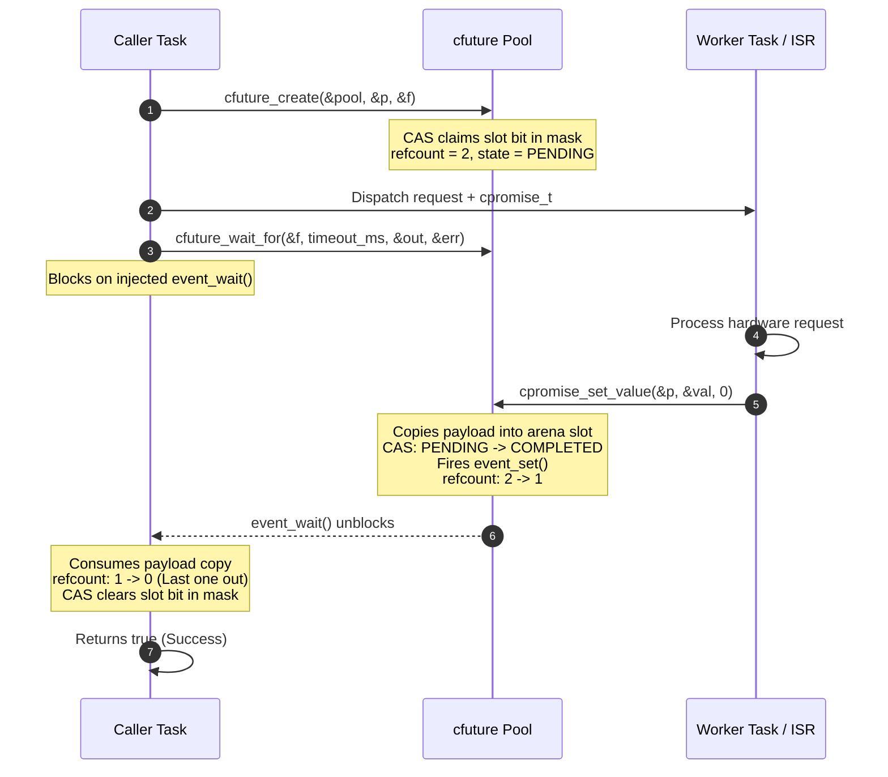
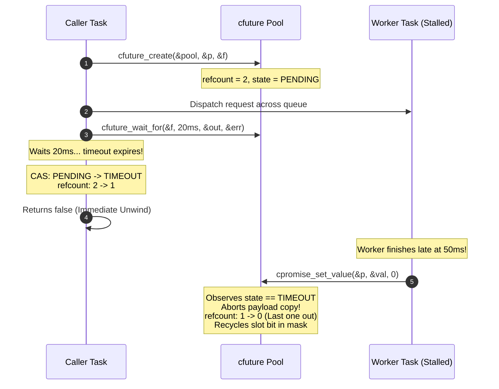

# libcfuture

> **Zero-Heap, Lock-Free Future/Promise Framework for Embedded Systems in C11**

[](LICENSE)
[](https://en.wikipedia.org/wiki/C11_(C_standard_revision))
[]()
[]()
[-success.svg)]()

---

## The Origin Story: The Dangling Stack Pointer Horror

In multi-tasking embedded firmware (running on FreeRTOS, Zephyr, or bare-metal RTOSes), subsystems frequently communicate across message queues. A typical architectural pattern is:

1. **Task A (Caller)** needs sensor telemetry or a cryptographic hash calculated by **Task B (Worker)**.
2. Task A allocates a response struct on its stack:
   ```c
   void do_reading(void)
   {
       sensor_response_t response;
       sensor_request_t req = { .reply_target = &response };
       os_queue_send(g_worker_queue, &req, 0);

       // Task A waits for Task B with a 50 ms timeout
       if (!os_event_wait(g_event, 50))
       {
           return; // TIMEOUT! Task A unwinds stack and exits function
       }
   }
   ```
3. A hardware glitch stalls the SPI/I2C peripheral on Task B for 70 ms.
4. Task A's 50 ms timeout expires. `do_reading()` returns. Task A's stack frame is unwound and reclaimed by subsequent function calls.
5. At 70 ms, Task B finally wakes up, writes the result to `req.reply_target`, and triggers memory corruption in Task A's active call stack.

### Why Existing Solutions Fail on Microcontrollers

| Alternative | Problem in Hard Real-Time Embedded Systems |
| :--- | :--- |
| **Forcing Caller to Hang** | Prevents dangling pointers, but destroys timeout responsiveness; stalls watchdogs and freezes UI/control loops. |
| **C++ `std::future`** | Mandatory dynamic memory (`new shared_state`), runtime exceptions, and RTTI overhead. Strictly forbidden in safety-critical firmware. |
| **Dynamic `malloc()` / `free()`** | Causes nondeterministic heap fragmentation and out-of-memory kernel panics. |
| **Global Static Variables** | Destroys reentrancy, prevents pipelining, and causes race conditions across concurrent callers. |

**`libcfuture` solves this permanently.** It provides a lock-free, zero-heap future/promise engine with dual-owner atomic reference counting ($2 \to 1 \to 0$) and instant, non-blocking $0\,\mu\text{s}$ timeout unwinding.

---

## Architectural Principles

1. **Zero Dynamic Allocation**: Pools and payload arenas are statically allocated by the application at compile time or linked into specific memory sections (e.g., DTCM, AXI SRAM, or non-cacheable DMA memory).
2. **Lock-Free Atomic State Transitions**: Slot allocation and state progression utilize atomic compare-and-swap (CAS) loops with bounded retries (`CFUTURE_CAS_MAX_RETRIES`), guaranteeing execution never hangs.
3. **Dual-Owner Lifetime Lifecycle ($2 \to 1 \to 0$)**: Every promise/future pair shares an atomic refcount initialized to 2. Whichever party finishes last recycles the slot bit back to the pool.
4. **Immediate Timeout Unwinding**: If a caller times out, it flips the slot state from `PENDING` to `TIMEOUT` via atomic CAS, drops its refcount, and returns immediately. If the worker finishes later, it observes the `TIMEOUT` state and recycles the slot without touching caller memory.
5. **Dependency Injection (DI) OSAL**: Pure interface table (`cfuture_sync_ops_t`) abstracts OS primitives without sprinkling code with `#ifdef`s. Includes drop-in adapters for POSIX, FreeRTOS, Zephyr, and Atomic Polling.
6. **ISR Safe**: Promises can be fulfilled or dropped directly from Interrupt Service Routines (`cpromise_set_value_from_isr`).

---

## Memory & Performance Footprint

Audited with `size` and `nm` on static library build:

```
   text    data     bss     dec     hex filename
   2765       0       0    2765     acd cfuture.c.o (libcfuture.a)
```

- **ROM / Flash Footprint**: **~2.7 KB** (Unoptimized debug object; < 1.2 KB with `-Os` on ARM Cortex-M).
- **Global Mutable State (`.data` + `.bss`)**: **0 bytes**. Purely reentrant.
- **Dynamic Allocations (`malloc` / `free`)**: **0 bytes**.

### Latency Benchmarks (x86_64 Host, Clang)

Measured over 100,000 iterations:

| Operation | Latency | Throughput |
| :--- | :--- | :--- |
| **Slot Claim + Abandon Cycle** | **52.1 ns/op** | **19,210,701 ops/sec** |
| **Synchronous Roundtrip (Create $\to$ Fulfill $\to$ Consume)** | **81.5 ns/op** | **12,269,024 ops/sec** |

---

## Concurrency Lifecycle Diagrams

### 1. Happy Path: Successful Asynchronous Request



### 2. Timeout Path: Fast Non-Blocking Caller Unwinding



---

## 5-Minute Onboarding Guide

### 1. Host / POSIX (Linux / macOS)

```c
#include "cfuture.h"
#include "adapters/cfuture_posix.h"
#include <stdio.h>

#define POOL_CAPACITY 8U

typedef struct
{
    float temperature_c;
    uint32_t timestamp_ms;
} telemetry_t;

CFUTURE_DEFINE_STATIC_BUFFERS(s_sensor, POOL_CAPACITY, sizeof(telemetry_t));
static cfuture_pool_t s_sensor_pool;

int main(void)
{
    const cfuture_sync_ops_t *sync_ops = cfuture_posix_sync_ops();
    cfuture_pool_init(&s_sensor_pool, POOL_CAPACITY, sizeof(telemetry_t),
                      s_sensor_slots, s_sensor_payload, sync_ops);

    cpromise_t promise;
    cfuture_t future;
    if (cfuture_create(&s_sensor_pool, &promise, &future))
    {
        // Fulfill promise
        telemetry_t sample = { .temperature_c = 23.4f, .timestamp_ms = 1000 };
        cpromise_set_value(&promise, &sample, 0);

        // Consume future
        telemetry_t result;
        int32_t error = 0;
        if (cfuture_wait_for(&future, 100, &result, &error))
        {
            printf("Temp: %.1f C at %u ms\n", result.temperature_c, result.timestamp_ms);
        }
    }

    cfuture_pool_destroy(&s_sensor_pool);
    return 0;
}
```

### 2. Windows (MSVC / Visual Studio / MinGW)

On Windows, use the native Win32 Event adapter (`adapters/cfuture_win32.h`):

```c
#include "cfuture.h"
#include "adapters/cfuture_win32.h"
#include <stdio.h>

#define POOL_CAPACITY 8U

CFUTURE_DEFINE_STATIC_BUFFERS(s_win_slots, POOL_CAPACITY, sizeof(uint32_t));
static cfuture_pool_t s_win_pool;

int main(void)
{
    const cfuture_sync_ops_t *sync_ops = cfuture_win32_sync_ops();
    cfuture_pool_init(&s_win_pool, POOL_CAPACITY, sizeof(uint32_t),
                      s_win_slots_slots, s_win_slots_payload, sync_ops);

    cpromise_t promise;
    cfuture_t future;
    if (cfuture_create(&s_win_pool, &promise, &future))
    {
        uint32_t val = 42;
        cpromise_set_value(&promise, &val, 0);

        uint32_t result = 0;
        if (cfuture_wait_for(&future, 100, &result, NULL))
        {
            printf("Received: %u\n", result);
        }
    }

    cfuture_pool_destroy(&s_win_pool);
    return 0;
}
```

### 3. Eclipse / Azure RTOS ThreadX

ThreadX event flags groups (`TX_EVENT_FLAGS_GROUP`) are supported via `adapters/cfuture_threadx.h`:

```c
#include "cfuture.h"
#include "adapters/cfuture_threadx.h"

#define POOL_CAPACITY 8U
CFUTURE_DEFINE_THREADX_EVENTS(s_tx, POOL_CAPACITY);
CFUTURE_DEFINE_STATIC_BUFFERS(s_tx_pool_buf, POOL_CAPACITY, sizeof(sensor_data_t));
static cfuture_pool_t s_tx_pool;

void thread_entry(ULONG param)
{
    cfuture_sync_ops_t tx_ops = {
        .event_create = NULL, // Statically initialized
        .event_set = cfuture_threadx_event_set,
        .event_wait = cfuture_threadx_event_wait,
        .event_reset = cfuture_threadx_event_reset,
        .event_set_from_isr = cfuture_threadx_event_set_from_isr,
    };
    // ...
}
```

### 4. Type-Safe Macro Interface (No `void *` Casts)

Define subsystem-specific typed wrappers in your headers with a single macro call:

```c
// In telemetry_service.h
typedef struct { float pressure_bar; } pressure_data_t;
CFUTURE_DEFINE_TYPED_POOL(Sensor, pressure_data_t, 8)

// In telemetry_service.c
Sensor_promise_t p;
Sensor_future_t f;
Sensor_create(&pool, &p, &f);

pressure_data_t tx = { .pressure_bar = 1.013f };
Sensor_promise_set(&p, &tx, 0);

pressure_data_t rx;
int32_t err = 0;
Sensor_future_wait(&f, 50, &rx, &err);
```

---

## Microcontroller Porting Notes

### STM32 (Cortex-M3 / M4 / M7 / M33)

- **Cache & Memory Placement**: Place `s_sensor_slots` and `s_sensor_payload` in non-cacheable SRAM or tightly-coupled memory (DTCM) using GCC attributes:
  ```c
  __attribute__((section(".dtcmram"))) static cfuture_slot_t s_slots[8];
  __attribute__((section(".dtcmram"))) static uint8_t s_arena[8 * sizeof(packet_t)];
  ```
- **L1 Cache Maintenance**: If buffers are placed in normal cached AXI SRAM, invalidate the caller's cache line after `cfuture_wait_for()` returns or clean before worker fulfillment:
  ```c
  SCB_InvalidateDCache_by_Addr((uint32_t *)rx_buffer, sizeof(rx_buffer));
  ```
- **Synchronization**: Inject FreeRTOS EventGroups (`adapters/cfuture_freertos.h`), Zephyr events (`adapters/cfuture_zephyr.h`), or ThreadX event flags (`adapters/cfuture_threadx.h`).

### ESP32 (Xtensa / RISC-V Dual-Core)

- Compatible across SMP cores via atomic compare-and-swap.
- Use `cfuture_freertos.h` for FreeRTOS EventGroup notifications across cores.

### Raspberry Pi Pico (RP2040 Cortex-M0+)

- Cortex-M0+ lacks native hardware 64-bit atomic instructions. `cfuture.h` uses `uint_fast32_t` (`uint32_t` on 32-bit MCUs), which maps directly to native 32-bit atomic load/store/LDREX/STREX instructions.
- Polling adapter (`cfuture_polling.h`) provides zero-dependency synchronization for bare-metal multi-core systems via hardware spinlocks.

---

## Automation Script (`build.py`)

A cross-platform Python CLI (`build.py`) is provided for Linux, macOS, and Windows:

```bash
# Run full quality pipeline (clean, build, tests, tsan, asan, stats, lint, bench)
python3 build.py --all

# Individual subcommands:
python3 build.py --build       # Configure & build release library
python3 build.py --test        # Run complete 7-suite unit test suite
python3 build.py --tsan        # Run 100k cycle ThreadSanitizer suite
python3 build.py --asan        # Run AddressSanitizer & UBSan suite
python3 build.py --stats       # Check .text/.data/.bss size & verify 0 dynamic allocations
python3 build.py --lint        # Run cppcheck and clang-format checks
python3 build.py --bench       # Run throughput and latency benchmarks
python3 build.py --soak 10     # Run hyper-speed soak test for 10 seconds
python3 build.py --clean       # Remove all build directories
```

---

## Hyper-Speed Soak & Overnight Stress Testing

To verify absolute stability, zero bitmask leaks, and zero memory corruption under continuous high-load multi-threaded hammering:

```bash
# Quick 10-second soak test (~18 Million cycles)
./build/benchmarks/bench_stress_soak --duration 10

# 8-Hour Overnight soak run (~50+ Billion cycles)
./build/benchmarks/bench_stress_soak --duration 28800

# Target specific cycle count (e.g. 50,000,000 cycles)
./build/benchmarks/bench_stress_soak --cycles 50000000
```

---

## Building with CMake & Nix

### Using Nix

```bash
# Enter isolated hermetic development shell
nix develop

# Run full automated verification
./build.py --all
```

---

## License

This project is licensed under the terms of the [MIT License](LICENSE).

